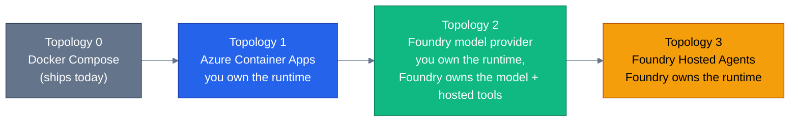
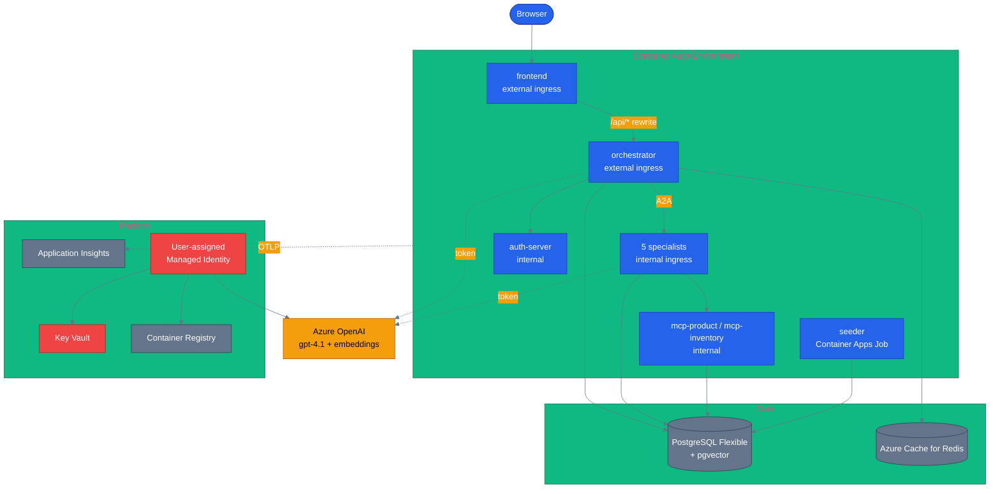
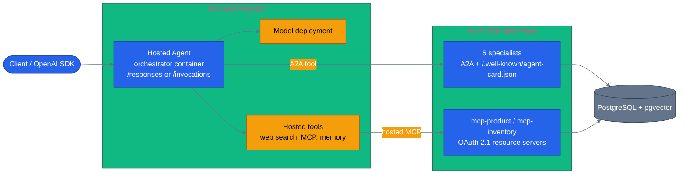

# Plan 13 — Azure Deployment and Microsoft Foundry

**Status:** proposed · **Date:** 2026-08-25 · **Parent:** [`../audit-2026-08-25-adoption-and-azure.md`](../audit-2026-08-25-adoption-and-azure.md)

Closes finding **F1**: the repository has no Azure deployment path of any kind. No Bicep, no
`azure.yaml`, no Terraform, no Kubernetes manifests, no Foundry integration. `docs/deployment.md`
is 428 lines of local Docker Compose.

The goal is not only "this app runs on Azure". It is a **reference for taking a multi-agent MAF
system to Azure**, using this app as the worked example, with the trade-offs written down. That is
the artifact the target audience is looking for and cannot currently find anywhere good.

---

## Contents

1. [Three topologies, and why all three](#1-three-topologies-and-why-all-three)
2. [Topology 1 — Azure Container Apps](#2-topology-1--azure-container-apps)
3. [Blockers found in the current code](#3-blockers-found-in-the-current-code)
4. [Repository layout](#4-repository-layout)
5. [Cost and teardown](#5-cost-and-teardown)
6. [Topology 2 — Foundry as model provider](#6-topology-2--foundry-as-model-provider)
7. [Topology 3 — Foundry Hosted Agents](#7-topology-3--foundry-hosted-agents)
8. [The finding worth writing up](#8-the-finding-worth-writing-up)
9. [Recording plan](#9-recording-plan)
10. [Phases and acceptance](#10-phases-and-acceptance)
11. [Risks](#11-risks)

---

## 1. Three topologies, and why all three

Each answers a different question, and the **difference between them is the content**. A post that
shows one deployment is a tutorial. A post that shows the same six agents in three topologies and
says what each one costs you is a reference.



| | Who runs the container | Who owns session state | Custom SSE frames | Effort from today |
|---|---|---|---|---|
| **T1 — ACA** | You | You (Postgres) | Yes, unchanged | 5–8 d |
| **T2 — Foundry provider** | You (ACA) | You (Postgres) | Yes, unchanged | 1–2 d on top of T1 |
| **T3 — Hosted Agents** | Foundry | Foundry (per-user `$HOME`) | Only via Invocations | 3–5 d on top of T2 |

**Recommendation: build T1 completely, then T2 as a config seam, then T3 for the orchestrator only.**
Do not attempt to move all six agents into Hosted Agents. The specialists are already A2A- and
MCP-addressable services; leaving them on ACA and calling them from a Foundry-hosted orchestrator is
both less work and a better architecture to demonstrate.

---

## 2. Topology 1 — Azure Container Apps

### Service mapping

| Compose service | Azure resource | Ingress | Notes |
|---|---|---|---|
| `frontend` | Container App | External | Proxies `/api/*` to the orchestrator — see blocker B1 |
| `orchestrator` | Container App | External | The only backend with a public FQDN |
| `product-discovery`, `order-management`, `pricing-promotions`, `review-sentiment`, `inventory-fulfillment` | 5 × Container App | **Internal** | One Bicep module, looped |
| `auth-server` | Container App | Internal | Token issuance is brokered by the orchestrator already |
| `mcp-product`, `mcp-inventory` | 2 × Container App | Internal (External for T3) | Must become External if Foundry hosted MCP calls them |
| `db` | PostgreSQL Flexible Server B1ms | — | `vector` must be added to `azure.extensions` |
| `redis` | Azure Cache for Redis Basic C0 | — | Basic has no SLA; adequate for demo, note it |
| `aspire` | Application Insights + Log Analytics | — | ACA environment OTLP config forwards traces |
| `seeder` | Container Apps **Job** (manual trigger) | — | Not a Container App; it must run once and exit |



### Identity and secrets

- **One user-assigned managed identity** shared by every container app. Role assignments: `AcrPull`
  on the registry, `Key Vault Secrets User` on the vault, `Cognitive Services OpenAI User` on the
  Azure OpenAI account.
- **No Azure OpenAI key anywhere.** This requires a code change — see blocker B2.
- `JWT_SECRET`, `AGENT_SHARED_SECRET`, `OAUTH_SEED_KEY`, `AUTH_SIGNING_KEY_ENCRYPTION_KEY` and the
  Postgres password live in Key Vault and reach the containers as ACA secret references resolved by
  the managed identity. None of them appear in Bicep parameters or in `azd env`.
- Postgres: Entra authentication for the app identity is the correct end state. For the first pass,
  a Key Vault–held password is acceptable and should be marked as such in the doc rather than
  presented as the recommendation.

### Networking

Public ACA environment, internal ingress for everything except the frontend and the orchestrator.
VNet integration and private endpoints are the enterprise upgrade and should be **documented as the
next step, not built** — they roughly double the provisioning time and the cost, and they are not
what the recording needs.

### Scale-to-zero

`minReplicas: 0` on all thirteen apps is correct for a purge-after-demo deployment and wrong for
recording it: a cold first request chains an orchestrator cold start into a specialist cold start,
which reads as a broken app on video. Ship a `--warm` flag on `azure-up.sh` that sets
`minReplicas: 1` on the frontend, orchestrator and the specialists being demonstrated, and returns
them to zero afterwards.

---

## 3. Blockers found in the current code

These are real and will each stop a deployment. Finding them now is the point of writing this before
the first `az` command.

### B1 — `NEXT_PUBLIC_API_URL` is inlined at build time, and the ACA FQDN does not exist until provision

`remaining-work.md` already records this constraint from the dual-backend E2E work: `NEXT_PUBLIC_*`
is baked into the Next.js build. On ACA, the orchestrator's FQDN is generated during provisioning,
so the frontend image cannot be built with the correct API URL before the infrastructure exists.

Three ways out:

1. **Two-phase deploy** — provision, read the FQDN, rebuild the frontend, deploy. Works, and makes
   `azd up` a lie.
2. **Custom domain** — pin `api.example.com` up front. Works, adds DNS and certificate steps to a
   quick start.
3. **Proxy `/api/*` through the Next.js server to the orchestrator's internal FQDN.** The browser
   only ever talks to its own origin, `NEXT_PUBLIC_API_URL` becomes a relative path, the orchestrator
   no longer needs external ingress at all, and CORS disappears.

**Take option 3.** It is the smallest change, it removes a public surface rather than adding one, and
it makes the same image work locally, on ACA, and behind a custom domain without a rebuild. It does
require confirming that SSE streams pass through the Next.js rewrite unbuffered — verify that
explicitly, because a buffering proxy will silently break the streaming chat and the mode graph.

### B2 — Azure OpenAI is key-only in both stacks

`.env.example` and `shared/config.py` take `AZURE_OPENAI_KEY`. Managed identity is the whole point of
deploying to Azure properly, and the .NET side already references `Azure.Identity`. Needed: an
`AZURE_OPENAI_AUTH=key|identity` seam that swaps in a token provider on both stacks. Small, and
without it the deployment demonstrates the wrong pattern.

### B3 — `AGENT_REGISTRY` is a JSON blob of Compose hostnames

```
AGENT_REGISTRY={"product-discovery":"http://product-discovery:8081", ...}
```

On ACA these become internal FQDNs like `https://product-discovery.internal.<env>.azurecontainerapps.io`,
generated at provision time and injected per-app. The registry needs to be assembled in Bicep and
passed in, not hardcoded. Also note the scheme change to `https` and the disappearance of the port —
if anything in the A2A client assumes `http://host:port`, it will break.

### B4 — pgvector is not enabled by default on Flexible Server

The `vector` extension must be added to the `azure.extensions` server parameter **before**
`docker/postgres/init.sql` runs, or every `CREATE EXTENSION vector` fails and the seed dies partway.
This is a Bicep ordering dependency, not a runtime one.

### B5 — the IVFFlat index is built on an empty table

Already found and documented in `remaining-work.md` as a production bug. It applies identically on
Azure: the seeder must populate before the index is created, or semantic search returns unrelated
products at similarity 0.000. Make sure the Container Apps Job ordering preserves whatever fix
landed locally.

### B6 — the Aspire dashboard has no Azure equivalent

`docs/telemetry.md` and the quick start both point at `localhost:18888`. On ACA the traces go to
Application Insights, where the GenAI view does not exist and the trace tree looks different. The
deployment doc needs its own telemetry section with Application Insights screenshots, or readers
will follow the local instructions and find nothing.

---

## 4. Repository layout

```
azure.yaml                        # azd service map
infra/
  main.bicep                      # subscription scope, creates the resource group
  main.parameters.json
  abbreviations.json
  core/
    identity.bicep                # user-assigned MI + role assignments
    registry.bicep                # ACR Basic
    keyvault.bicep                # vault + secrets + access policy via RBAC
    postgres.bicep                # Flexible Server, azure.extensions=vector, firewall
    redis.bicep                   # Cache for Redis Basic C0
    monitoring.bicep              # Log Analytics + Application Insights
    aca-environment.bicep         # environment + OTLP configuration
  app/
    container-app.bicep           # generic module: image, env, secrets, ingress, scale
    specialist.bicep              # thin wrapper, looped over the five specialists
    seeder-job.bicep              # Container Apps Job, manual trigger
scripts/
  azure-up.sh                     # azd provision + deploy + seed, --warm flag
  azure-down.sh                   # delete the resource group, purge the soft-deleted vault
  azure-up.ps1 / azure-down.ps1   # PowerShell twins, matching the dev.sh/dev.ps1 convention
docs/
  azure-deployment.md             # new page: topology, cost, teardown, gotchas
```

Write `azure-down.sh` **first**, and test it against a resource group containing one dummy resource,
before `azure-up.sh` is ever run. It must also purge the soft-deleted Key Vault, or the next
deployment fails on a name collision with a confusing error.

---

## 5. Cost and teardown

Estimates only — verify against the pricing calculator at deploy time, and put the verified numbers
in the published doc rather than these.

| Resource | SKU | Standing (monthly) | 4-hour session |
|---|---|---|---|
| Container Apps | Consumption, scale-to-zero | ~$0 idle (free grant covers a demo) | ~$0 |
| Container Registry | Basic | ~$5 | ~$0.02 |
| PostgreSQL Flexible | B1ms + 32 GB | ~$15–20 | ~$0.10 |
| Azure Cache for Redis | Basic C0 | ~$16 | ~$0.09 |
| Log Analytics + App Insights | pay per GB | ~$2–5 | negligible |
| Azure OpenAI | gpt-4.1 pay-per-token | usage | usage |
| **Total** | | **~$40–60/mo** | **~$1–3 + tokens** |

The record-then-purge plan is sound. Two conditions on it:

1. **A budget alert on the subscription before the first deploy**, not after. An orphaned Redis or a
   Log Analytics workspace left behind is how a $3 demo becomes a $40 monthly line item nobody
   notices for a quarter.
2. **A dedicated resource group per deployment**, so teardown is one delete and cannot miss anything.

---

## 6. Topology 2 — Foundry as model provider

The smallest change with the largest story. Add a `foundry` value to the existing `LLM_PROVIDER`
seam, so the same six agents run against a Foundry project endpoint instead of a standalone Azure
OpenAI resource.

**Python** — `pip install agent-framework-foundry`:

```python
from agent_framework import Agent
from agent_framework.foundry import FoundryChatClient
from azure.identity import ManagedIdentityCredential

agent = Agent(
    client=FoundryChatClient(
        project_endpoint=settings.FOUNDRY_PROJECT_ENDPOINT,
        model=settings.FOUNDRY_MODEL,
        credential=ManagedIdentityCredential(client_id=settings.AZURE_CLIENT_ID),
    ),
    name="product-discovery",
    instructions=get_system_prompt(current_user_role.get()),
    tools=[...],
)
```

**.NET** — `dotnet add package Microsoft.Agents.AI.Foundry --prerelease`:

```csharp
AIAgent agent = new AIProjectClient(projectEndpoint, credential)
    .AsAIAgent(model: deployment, name: "product-discovery", instructions: systemPrompt);
```

This slots into `agent_factory.py` and the .NET equivalent as a third branch. Everything downstream —
tools, prompts, context providers, middleware, grounding, guardrails — is unchanged, because both
produce a standard `Agent` / `AIAgent`.

**What it buys, and this is the point of doing it:** the same agents gain access to Foundry's hosted
tool surface — web search, code interpreter, file search, Azure AI Search, hosted MCP, and a
Foundry-managed memory store. A concrete demonstration for this repo: give `review-sentiment` the
hosted web-search tool so it can compare in-catalogue sentiment against public sentiment for the same
product. That is one tool registration and it makes the "why Foundry rather than Azure OpenAI" case
in ten seconds of video.

**Two things to check before committing to this:**

- **Embeddings are a separate endpoint.** `FoundryChatClient` uses the project endpoint;
  `FoundryEmbeddingClient` uses a distinct `FOUNDRY_MODELS_ENDPOINT` with its own key. The repo's
  1536-dim `text-embedding-3-small` pipeline and the `generate_embeddings` script both need to route
  correctly, and a dimension mismatch silently corrupts the pgvector column.
- **Model and tool availability is regional.** The Foundry project region constrains which models and
  which hosted tools exist, which constrains what the comparison page can claim. Pick the region
  first and record it in the doc.

---

## 7. Topology 3 — Foundry Hosted Agents

Foundry Hosted Agents is generally available; the Agent Framework hosting packages
(`agent-framework-foundry-hosting` for Python, `Microsoft.Agents.AI.Foundry.Hosting` for .NET) are
**prerelease**. Say so in the write-up.

### The shape to build

Do not move all six agents. Move **the orchestrator only**, and leave the specialists on ACA:



### Why this composition, specifically

**The repo is already built for it, in two ways that were not designed for Foundry and happen to fit
exactly.**

1. **Every specialist already serves `/.well-known/agent-card.json`** (`shared/agent_host.py:249`,
   and it is in `PUBLIC_PATHS` in `shared/auth.py`). That is precisely the default path Foundry's
   preview A2A tool (`FoundryChatClient.get_a2a_tool(base_url=..., agent_card_path=...)`) fetches.
   A Foundry-hosted orchestrator can discover and call the ACA specialists **with no change to the
   specialists at all**.
2. **Both MCP servers are already OAuth 2.1 resource servers** with audience and scope validation and
   a `.well-known/oauth-protected-resource` document — shipped in plan 10. Foundry's hosted MCP tool
   (`get_mcp_tool`, GA) is the more mature integration point than the preview A2A tool, and the repo
   is already compliant with it.

**Recommendation: lead with hosted MCP, and treat the A2A tool as the secondary demonstration.**
Hosted MCP is GA, the auth story is already solved in this repo, and it degrades gracefully. The A2A
tool is preview and its authentication story against `/message:send` — which requires either
`X-Agent-Secret` or an OAuth scope — is unverified. Prove that before promising it.

### Responses vs Invocations — the decision that matters

| | Responses | Invocations |
|---|---|---|
| Endpoint | `/responses`, OpenAI-compatible | Whatever you define |
| History and session | Managed by the platform | Yours |
| Streaming | Managed by the platform | Yours |
| Custom SSE frames (`node`, `handoff`, `checkpoint`, `step`) | **No** | Yes |
| Python entry point | `ResponsesHostServer(agent)` | `InvocationsHostServer(agent)` or `InvocationAgentServerHost` |
| .NET entry point | `AddFoundryResponses` + `MapFoundryResponses` | `AddInvocationsServer` + `InvocationHandler` |

This repo's chat surface depends on named SSE frames that the web client routes through
`onOrchestrationEvent` — the live graph animation, the handoff trace, the checkpoint markers, the
approval gate. **The Responses protocol cannot carry them.** A Responses-hosted orchestrator gives a
working chat and a dead graph.

So:

- **Ship the Invocations variant** if the existing frontend must work unchanged. More work, and it
  reuses the SSE translation already written in `chat.py::chat_stream`.
- **Ship the Responses variant as well, deliberately reduced**, because "any OpenAI SDK can call your
  six-agent system with three lines of code" is a genuinely strong demonstration and is worth the
  loss of the graph in that specific clip.

Showing both, side by side, with the reason, is better content than either alone.

### Session state collision

Hosted Agents persist `$HOME` and uploaded files per user across turns and idle periods. This repo
persists sessions in Postgres and rehydrates specialist context from it
(`shared/agent_host.py::_rehydrate_history_from_session`). Running both means two sources of truth
for conversation history. Pick one, in writing, in the doc — the Postgres store is the right choice
here because the specialists depend on it and the platform store does not reach them.

### Local loop

```bash
azd ext install azure.ai.agents
azd ai agent init -m <manifest>
export FOUNDRY_PROJECT_ENDPOINT="https://<account>.services.ai.azure.com/api/projects/<project>"
export AZURE_AI_MODEL_DEPLOYMENT_NAME="<deployment>"
azd ai agent run                       # host on http://localhost:8088
azd ai agent invoke --local "Hello!"
azd provision                          # Foundry project, ACR, App Insights, RBAC
azd deploy                             # build, push, register as a hosted agent
```

Foundry injects `FOUNDRY_PROJECT_ENDPOINT`, `AZURE_AI_MODEL_DEPLOYMENT_NAME` and
`APPLICATIONINSIGHTS_CONNECTION_STRING` into the container at runtime — which means the OTel wiring
in `shared/telemetry.py` needs an App Insights branch to use it.

---

## 8. The finding worth writing up

Most Foundry content stops at "here is a hosted agent saying hello". The material below is what
someone with a real system actually hits, and this repo is positioned to be the first place it is
written down properly:

1. **Responses is OpenAI-shaped, and an OpenAI-shaped stream cannot express a multi-agent execution
   graph.** The moment you have your own event vocabulary, managed streaming becomes a constraint
   rather than a convenience. Invocations exists for exactly this, and nobody explains why.
2. **Managed session state fights an existing session store.** The platform's per-user persistence is
   a benefit for a single agent and a second source of truth for a fleet.
3. **A2A and MCP are not interchangeable as Foundry integration surfaces.** Hosted MCP is GA with a
   solved auth story; the A2A tool is preview. A system that speaks both — as this one does — can
   pick, and the reasoning generalises.
4. **A managed runtime does not remove the data tier.** Postgres, pgvector, Redis and the seeder are
   still yours in every topology. The Foundry story often implies otherwise.
5. **What each topology actually costs**, measured, with the same workload run through all three.

---

## 9. Recording plan

Two separate recordings, produced from this work.

**Clip A — 60–90 s, silent, looping.** Local stack, no narration, no intro. Ask a question, switch
orchestration mode, watch the graph animate, watch cards render, hit the approval gate, approve,
watch it resume. This goes at the top of the README and the site home and is the conversion fix from
finding F3. It does not depend on any of the Azure work and should be recorded first.

**Clip B — 12–18 min, narrated: "Deploying a six-agent MAF system to Azure".** Structure:

1. 0:00–1:30 — the app working locally (Clip A material, narrated)
2. 1:30–4:00 — the topology and the four blockers found before writing any Bicep
3. 4:00–8:00 — `azure-up.sh`, the deployment happening, the app live on an ACA URL
4. 8:00–12:00 — switching to a Foundry project endpoint; the hosted web-search tool appearing on
   `review-sentiment`
5. 12:00–16:00 — the orchestrator as a Hosted Agent, Responses vs Invocations, and the graph going
   dead on Responses — **shown, not described**
6. 16:00–18:00 — `azure-down.sh`, the cost table, what I would do differently

Point 5 is the reason anyone shares the video. Do not cut it.

---

## 10. Phases and acceptance

### Phase A — unblock (2 d)

- [ ] B1: `/api/*` proxied through Next.js; `NEXT_PUBLIC_API_URL` becomes relative. **Acceptance:**
      the existing Playwright suite passes unchanged, *and* SSE streaming and the live mode graph are
      verified through the proxy — not assumed.
- [ ] B2: `AZURE_OPENAI_AUTH=key|identity` on both stacks. **Acceptance:** a live chat turn against
      Azure OpenAI with no key in the environment.
- [ ] B3: `AGENT_REGISTRY` assembled from Bicep outputs; A2A client verified against `https` with no
      port.

### Phase B — ACA (4 d)

- [ ] `infra/` Bicep, `azure.yaml`, `azure-down.sh` written and tested **first**
- [ ] B4/B5: pgvector enabled before init.sql; seeder job ordered before index creation
- [ ] B6: Application Insights telemetry section in the deployment doc
- [ ] **Acceptance:** from a clean subscription, `./scripts/azure-up.sh` produces a working public
      URL where a signed-in user completes a chat turn with product cards and one approval gate; the
      Playwright suite passes against that URL via `E2E_BASE_URL`; `./scripts/azure-down.sh` leaves
      zero resources and no soft-deleted vault.

### Phase C — Foundry provider (2 d)

- [ ] `LLM_PROVIDER=foundry` on both stacks; embeddings endpoint resolved
- [ ] Hosted web-search tool on `review-sentiment` as the demonstration
- [ ] **Acceptance:** the eval smoke suite passes under the Foundry provider; a live turn shows the
      hosted tool being called in the Application Insights trace.

### Phase D — Hosted Agents (3–5 d)

- [ ] Orchestrator packaged for Invocations; specialists reached via hosted MCP
- [ ] Responses variant built alongside, with the graph loss documented and filmed
- [ ] **Acceptance:** both variants deployed and callable; the Invocations variant drives the
      existing frontend unchanged; one A2A-tool call to an ACA specialist proven or explicitly
      recorded as not working, with the reason.

### Phase E — publish (2 d)

- [ ] `docs/azure-deployment.md` on the site, with verified cost numbers
- [ ] Clip A embedded; Clip B recorded and linked
- [ ] README "Deploy to Azure" entry in the *Where to start* table

---

## 11. Risks

| Risk | Impact | Mitigation |
|---|---|---|
| Hosting packages are prerelease and may change | Rework mid-phase | Pin versions; date-stamp the doc; keep the T1 path independent of T3 |
| A2A tool auth against `/message:send` unproven | Phase D scope grows | Lead with hosted MCP; treat A2A as a stretch and record the negative result honestly if it fails |
| Cost drift after the recording | Ongoing charges | Budget alert before the first deploy; dedicated resource group; teardown tested before use |
| SSE breaks through the Next.js proxy | Chat and graph die on ACA only | Explicit streaming test in Phase A, before any Bicep is written |
| Foundry region limits models or hosted tools | Comparison claims become wrong | Pick and record the region in Phase C; state it on the published page |
| Scope creep into private endpoints and VNet | Phase B doubles | Explicitly out of scope; documented as the next step |
