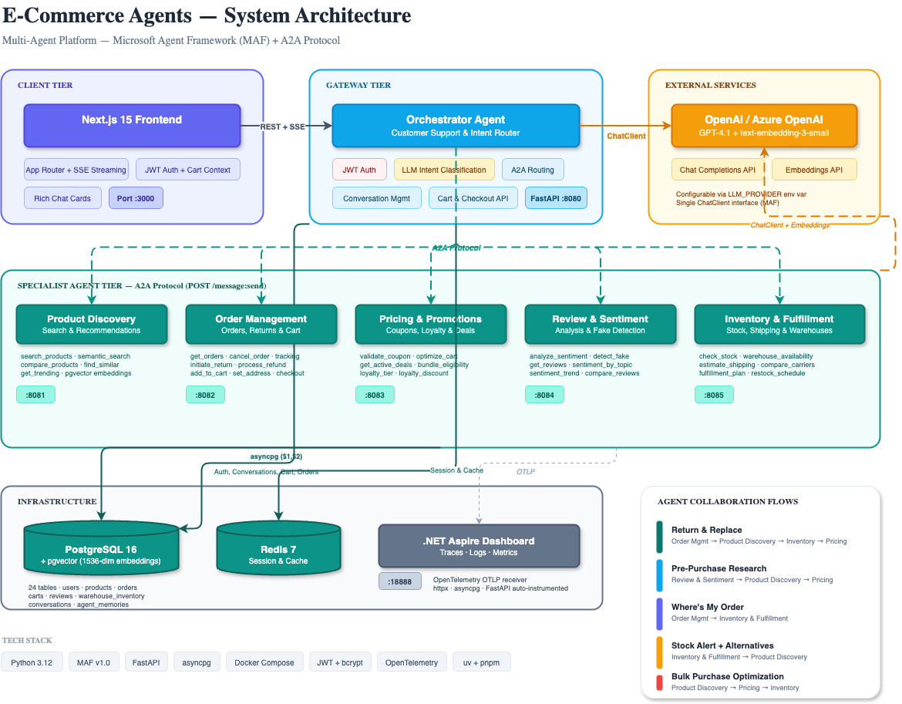
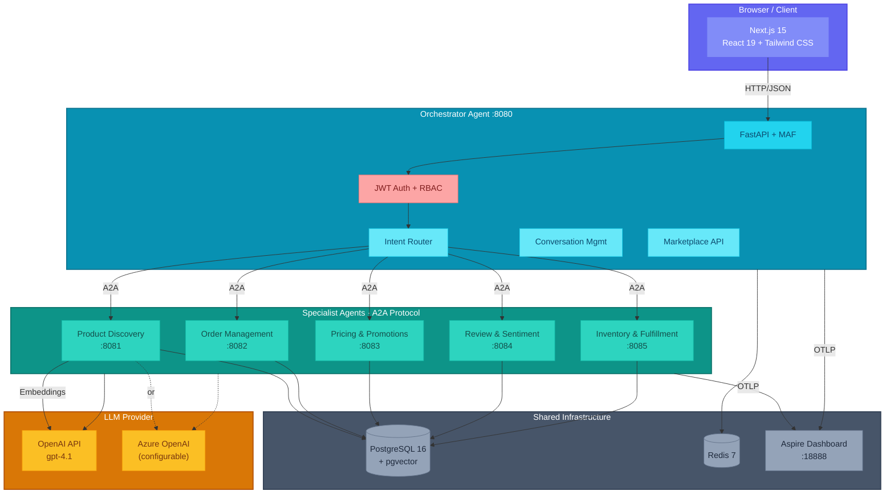

# E-Commerce Agents

[](LICENSE)
[](https://python.org)
[](https://nextjs.org)
[](https://docs.docker.com/compose/)

A **multi-agent e-commerce platform** built with [Microsoft Agent Framework](https://github.com/microsoft/agent-framework) (MAF) Python SDK. Six specialized AI agents collaborate via **A2A protocol** to handle product discovery, orders, pricing, reviews, inventory, and customer support.

Companion demo repo for the AI article series on [nitinksingh.com](https://nitinksingh.com).

---

## Project Status

**This is v1 — the Python version is live today.** It runs end-to-end: six specialist agents, orchestrator, marketplace, auth, telemetry, and a full Next.js frontend.

Several larger capabilities are actively in progress and will land in upcoming releases. Track them in the [Roadmap](#roadmap) section below. The **.NET / C# port** for teams building in the Microsoft ecosystem is scaffolded at [`dotnet/`](./dotnet/) and ships module-by-module via the plans in [`plans/dotnet-port/`](./plans/dotnet-port/).

---

## Learning Path — *MAF v1: Python and .NET*

A new step-by-step tutorial series walks through **every Microsoft Agent Framework concept** — agents, tools, memory, middleware, workflow primitives, all five orchestration patterns, HITL, checkpoints, declarative workflows, visualization — with runnable examples in **both Python and .NET**. This repository is the capstone.

**Start here:** [`tutorials/README.md`](./tutorials/README.md)

| Tier | Chapters | Topics |
|------|----------|--------|
| 1 · Core Agent | [01–04](./tutorials/) | First agent · tools · streaming · sessions |
| 2 · Agent Internals | 05–08 | Context providers · middleware · OpenTelemetry · MCP |
| 3 · Workflow Foundations | 09–11 | Executors · edges · events · builder · agents in workflows |
| 4 · Orchestrations | 12–16 | Sequential · Concurrent · Handoff · Group Chat · Magentic |
| 5 · Advanced | 17–20 | HITL · checkpoints · declarative YAML · visualization |
| Capstone | 21 | Guided tour of this repo |

Each chapter has `python/`, `dotnet/`, `tests/`, a Hugo-ready article draft (`README.md`), and a per-chapter plan (`PLAN.md`). Chapters cross-post to [nitinksingh.com](https://nitinksingh.com) under the *MAF v1: Python and .NET* series, complementing the [original Python-only series](https://nitinksingh.com/posts/building-a-multi-agent-e-commerce-platform-the-complete-guide/).

> Looking for implementation plans? See [`plans/README.md`](./plans/README.md) for the .NET port, refactor-to-MAF-workflows, and publishing sub-plans.

---

## Table of Contents

- [Learning Path](#learning-path--maf-v1-python-and-net)
- [Architecture](#architecture)
- [Quick Start](#quick-start)
- [Test Users](#test-users)
- [Agent Catalog](#agent-catalog)
- [Demo Scenarios](#demo-scenarios)
- [Tech Stack](#tech-stack)
- [Project Structure](#project-structure)
- [Configuration](#configuration)
- [Documentation](#documentation)
- [Port Map](#port-map)
- [Roadmap](#roadmap)
- [Contributing](#contributing)
- [License](#license)

---

## Architecture



<details>
<summary>View as Mermaid diagram</summary>


</details>

---

## Quick Start

### Prerequisites

- [Docker](https://docs.docker.com/get-docker/) and Docker Compose
- An [OpenAI API key](https://platform.openai.com/api-keys) (or Azure OpenAI credentials)

### Setup

```bash
# 1. Clone the repo
git clone https://github.com/nitin27may/e-commerce-agents.git
cd e-commerce-agents

# 2. Configure environment
cp .env.example .env
# Edit .env — add your OPENAI_API_KEY (or Azure OpenAI credentials)

# 3. Start everything (builds, seeds, and starts all services)
./scripts/dev.sh
```

Open in your browser:
- **Frontend**: http://localhost:3000
- **Aspire Dashboard** (telemetry): http://localhost:18888

### Other Commands

```bash
./scripts/dev.sh --clean       # Nuke volumes, rebuild from scratch
./scripts/dev.sh --seed-only   # Re-run database seeder only
./scripts/dev.sh --infra-only  # Start db + redis + aspire only
```

---

## Test Users

Pre-seeded accounts for testing different roles:

| Email | Password | Role | Loyalty Tier |
|-------|----------|------|-------------|
| `admin.demo@gmail.com` | admin123 | Admin | Gold |
| `power.demo@gmail.com` | power123 | Power User | Gold |
| `seller.demo@gmail.com` | seller123 | Seller | Bronze |
| `alice.johnson@gmail.com` | customer123 | Customer | Gold |
| `bob.smith@gmail.com` | customer123 | Customer | Silver |

---

## Agent Catalog

| Agent | Port | Description | Key Tools |
|-------|------|-------------|-----------|
| **Customer Support** (Orchestrator) | 8080 | Routes requests to specialists via A2A | `call_specialist_agent` |
| **Product Discovery** | 8081 | Search, semantic search, comparisons, trending | `search_products`, `semantic_search`, `compare_products` |
| **Order Management** | 8082 | Order tracking, cancellation, returns, refunds | `get_user_orders`, `cancel_order`, `initiate_return` |
| **Pricing & Promotions** | 8083 | Coupon validation, cart optimization, loyalty | `validate_coupon`, `optimize_cart`, `get_active_deals` |
| **Review & Sentiment** | 8084 | Sentiment analysis, fake review detection | `analyze_sentiment`, `detect_fake_reviews` |
| **Inventory & Fulfillment** | 8085 | Stock, shipping estimates, fulfillment planning | `check_stock`, `estimate_shipping` |

---

## Demo Scenarios

Try these in the chat after logging in:

1. **Product Search**: "Find me wireless headphones under $300 with good noise cancellation"
2. **Comparison**: "Compare the Sony WH-1000XM5 with AirPods Max"
3. **Order Tracking**: "Where's my latest order?"
4. **Return Flow**: "I want to return my last order"
5. **Price Check**: "Is the Logitech MX Master 3S a good deal right now?"
6. **Review Analysis**: "What do people think about the Dyson V15?"
7. **Stock Check**: "Is the Dyson V15 Detect in stock?"
8. **Multi-Intent**: "Return my jacket and find me a warmer one under $200"

---

## Tech Stack

| Layer | Technology |
|-------|-----------|
| Agent Framework | [Microsoft Agent Framework](https://github.com/microsoft/agent-framework) v1.0 (Python SDK) |
| Agent Communication | A2A Protocol (HTTP) |
| LLM | OpenAI / Azure OpenAI (gpt-4.1) |
| Orchestrator | FastAPI (Python 3.12) |
| Database | PostgreSQL 16 + pgvector (1536-dim embeddings) |
| Cache | Redis 7 |
| Frontend | Next.js 15, React 19, Tailwind CSS, shadcn/ui |
| Auth | Self-contained JWT (PyJWT + bcrypt) |
| Telemetry | OpenTelemetry &rarr; .NET Aspire Dashboard |
| Package Managers | uv (Python), pnpm (Node) |
| Containerization | Docker Compose |

---

## Project Structure

```
e-commerce-agents/
├── docker-compose.yml               # 11 services with profiles
├── .env.example                     # Environment template
├── agents/                          # Python backend
│   ├── Dockerfile                   # Multi-target (ARG AGENT_NAME)
│   ├── pyproject.toml               # Dependencies (MAF, OTel, FastAPI)
│   ├── shared/                      # Shared library
│   │   ├── telemetry.py            # OTel auto-instrumentation
│   │   ├── config.py               # Pydantic Settings
│   │   ├── db.py                   # asyncpg connection pool
│   │   ├── auth.py                 # JWT + inter-agent auth
│   │   ├── agent_factory.py        # OpenAI / Azure client factory
│   │   ├── agent_host.py           # A2A-compatible agent host
│   │   ├── prompt_loader.py        # YAML prompt loader
│   │   └── tools/                  # Shared tool functions
│   ├── config/prompts/             # YAML prompt configs per agent
│   ├── orchestrator/               # Customer Support (:8080)
│   ├── product_discovery/          # Product Discovery (:8081)
│   ├── order_management/           # Order Management (:8082)
│   ├── pricing_promotions/         # Pricing & Promotions (:8083)
│   ├── review_sentiment/           # Review & Sentiment (:8084)
│   └── inventory_fulfillment/      # Inventory & Fulfillment (:8085)
├── docker/postgres/
│   └── init.sql                    # 24-table schema + pgvector
├── scripts/
│   ├── dev.sh                      # One-command dev setup
│   ├── seed.py                     # Database seeder
│   └── generate_embeddings.py      # Product embedding generation
├── web/                            # Next.js frontend
│   └── src/
│       ├── app/                    # 16 routes (App Router)
│       ├── components/             # UI components (shadcn/ui)
│       └── lib/                    # API client, auth context
└── docs/                           # Detailed documentation
    ├── architecture.md
    ├── api-reference.md
    ├── database-schema.md
    ├── telemetry.md
    ├── agent-flows.md
    └── deployment.md
```

---

## Configuration

Copy `.env.example` to `.env` and configure your LLM provider:

```bash
# OpenAI (default)
LLM_PROVIDER=openai
OPENAI_API_KEY=sk-...
LLM_MODEL=gpt-4.1

# Azure OpenAI (alternative)
LLM_PROVIDER=azure
AZURE_OPENAI_ENDPOINT=https://your-resource.openai.azure.com/
AZURE_OPENAI_KEY=...
AZURE_OPENAI_DEPLOYMENT=gpt-4.1
```

See [Deployment Guide](docs/deployment.md) for all configuration options.

---

## Documentation

| Document | Description |
|----------|-------------|
| [Architecture](docs/architecture.md) | System design, agent patterns, auth flow |
| [API Reference](docs/api-reference.md) | All REST endpoints with examples |
| [Database Schema](docs/database-schema.md) | 24 tables with ER diagram |
| [Telemetry](docs/telemetry.md) | OpenTelemetry setup and Aspire Dashboard |
| [Agent Flows](docs/agent-flows.md) | Multi-agent collaboration diagrams |
| [Deployment](docs/deployment.md) | Docker Compose, dev.sh, port map |

---

## Port Map

| Service | Port | URL |
|---------|------|-----|
| Frontend | 3000 | http://localhost:3000 |
| Orchestrator | 8080 | http://localhost:8080 |
| Product Discovery | 8081 | |
| Order Management | 8082 | |
| Pricing & Promotions | 8083 | |
| Review & Sentiment | 8084 | |
| Inventory & Fulfillment | 8085 | |
| Aspire Dashboard | 18888 | http://localhost:18888 |
| PostgreSQL | 5432 | |
| Redis | 6379 | |

---

## Roadmap

This is v1. The Python platform is live and stable. Several high-impact capabilities are actively in progress — we're shipping them incrementally and they will land in upcoming releases.

Legend: `- [x]` shipped in v1 · `- [ ]` planned or in progress. Items tagged **`In progress`** are under active development and will land in upcoming releases.

### In Progress — Coming Soon

The following items are under active development and will land in the next few releases:

- [ ] **Agent evaluators** `In progress` — automated response-quality measurement across every specialist. Scripted eval sets (precision@k, recall@k, answer faithfulness, tool-call correctness) run against the seeded catalog with nightly CI gating, so regressions are caught before they reach production.
- [ ] **Prompt injection prevention** `In progress` — hardening against a massively underestimated attack surface. Input classification, system-prompt isolation, tool-allow-listing per role, and output filtering before any user-facing render. Every specialist gets the same defense-in-depth layer.
- [ ] **Session memory & context persistence** `In progress` — long-running memory across conversations. Per-user preferences, recent intents, and past orders are surfaced to the orchestrator via a dedicated memory tool, so follow-ups feel continuous rather than amnesiac.
- [ ] **Human-in-the-loop approval flows** `In progress` — explicit approval gates for high-stakes actions (refunds over a threshold, inventory writes, bulk price changes). The agent pauses, renders an approval card in the UI, and only proceeds once the operator confirms.
- [ ] **Per-agent cost tracking** `In progress` — token spend and dollar cost attributed to each specialist, each tool call, and each user session. Surfaced as first-class OpenTelemetry metrics in the Aspire Dashboard.
- [ ] **Full .NET / C# port** `In progress` — a sibling repository targeting teams building in the Microsoft ecosystem, powered by the [Microsoft Agent Framework .NET SDK](https://github.com/microsoft/agent-framework). Same six agents, same A2A protocol, same PostgreSQL schema — idiomatic .NET throughout.

> **Status:** the Python version is live today. The .NET version is coming.

---

### Planned — Search & Retrieval

Today, `search_products` uses `ILIKE '%word%'` pattern matching split on whitespace. This works for exact keyword matches but misses stems, synonyms, and relevance ranking. The product catalog already has 1536-dim embeddings stored in `product_embeddings` (pgvector + ivfflat), and a separate `semantic_search` tool, but the two retrieval paths are not yet fused.

- [ ] **Postgres full-text search in `search_products`** — add a generated `tsvector` column on `products(name, description, brand)`, a GIN index, and replace the `ILIKE` loop with `plainto_tsquery` + `ts_rank` for stemming, multi-word matching, and proper relevance ordering.
- [ ] **Hybrid retrieval (FTS + vector)** — combine lexical (FTS) and semantic (pgvector) scores via Reciprocal Rank Fusion in a single CTE. Beats either approach alone on ambiguous queries like "something cozy for winter" or "gift for a developer".
- [ ] **Smarter tool routing** — update `agents/config/prompts/product-discovery.yaml` so the LLM routes descriptive / vague queries to `semantic_search` and attribute-driven queries ("Nike running shoes under $100") to `search_products`.
- [ ] **Typed filter DSL** — replace the flat parameter list on `search_products` with a structured `ProductFilters` Pydantic model (category, price range, brand, specs match, sort) that the LLM populates as JSON. Keeps SQL parameterized and safe while giving the model more expressive power than fixed arguments.

**Why not text-to-SQL?** A dynamic "LLM writes the query" approach was considered and rejected for this codebase:

- **Security** — tools currently enforce `user_email` / `user_role` scoping via ContextVars. LLM-generated SQL bypasses that contract and would require full Postgres RLS across all 24 tables plus a read-only role and a SQL parser to reject writes.
- **Correctness on financial data** — orders, payments, returns, and loyalty points can't tolerate hallucinated JOINs or missing soft-delete filters.
- **Retrieval quality** — the real problem is that `ILIKE` ignores the embeddings that already exist. Hybrid search solves that without handing the model a SQL console.
- **Determinism & observability** — hardcoded `@tool` functions produce stable OpenTelemetry spans, cacheable parameter shapes, and reproducible tests.

The typed filter DSL gives the model flexibility at the boundary while keeping SQL generation server-side, parameterized, and auditable.

---

### Planned — MCP as the Agent Data-Access Layer

Today, specialist agents call data tools directly via MAF's `@tool` decorator over asyncpg (`shared/tools/inventory_tools.py`, `shared/tools/cart_tools.py`, etc.). A reference [Model Context Protocol](https://modelcontextprotocol.io/) server already exists at `agents/mcp/inventory_server.py` — it exposes `check_stock`, `get_warehouses`, and `estimate_shipping` over the MCP standard — but no agent currently routes through it.

**The planned shift:** migrate agent queries from the native `@tool` path to MCP tool calls, so the MCP server becomes the single query surface for all data access. Any MCP-compatible runtime (Claude Desktop, Cursor, MAF's `MCPStreamableHTTPTool`, an external LangGraph agent) gets the same capabilities with zero glue code.

- [ ] **Promote the inventory MCP server into the compose stack** — add it as a service on port 9000, health-check it, and have the `inventory-fulfillment` agent consume it via MCP instead of importing `inventory_tools.py` directly.
- [ ] **Expand the MCP surface beyond inventory** — port `product_tools`, `order_tools`, `cart_tools`, `pricing_tools`, and `review_tools` into MCP servers, each publishing its own `/.well-known/mcp.json`. Land one specialist at a time so the migration is incremental and reversible.
- [ ] **Agent-side MCP client wiring** — replace the `tools=[native_tool, ...]` lists in `create_<agent>_agent()` factories with an MCP client that discovers tools from the manifest at startup. Preserves the `@tool` signature contract so prompts and tool-call loops stay unchanged.
- [ ] **Auth propagation** — today, `user_email` / `user_role` flow through ContextVars inside the same process. Over MCP, they'll need to ride as authenticated headers (`X-User-Email`, `X-User-Role`) signed by `AGENT_SHARED_SECRET`, mirroring the existing A2A inter-agent pattern in `shared/auth.py`.
- [ ] **Telemetry parity** — MCP tool calls should produce the same OpenTelemetry spans (`tool.call`, `tool.result`) that native `@tool` calls emit today, so Aspire Dashboard views keep working after the cutover.
- [ ] **Eval gate** — expand `agents/evals/` to run each dataset twice (once against native tools, once against MCP) and fail CI if the MCP run scores below the native baseline.

**Why bother?**

- **Language-agnostic tool layer** — any runtime that speaks MCP (not just MAF, not just Python) can talk to the platform's data without importing Python modules.
- **Clean separation of concerns** — agents become pure reasoning + orchestration; data access lives behind a versioned, discoverable protocol.
- **External integration surface** — opens the door to Claude Desktop / Cursor / third-party agents consuming the same tools the internal specialists use, with identical auth and observability.
- **Incremental, reversible** — each specialist can be cut over independently; the native `@tool` path stays as a fallback until the MCP server is at feature + performance parity.

**Quick demo of the existing standalone server** (nothing migrated yet — just the reference implementation):

```bash
# Start the MCP server (Postgres already running via ./scripts/dev.sh)
cd agents && uv run uvicorn mcp.inventory_server:app --port 9000

# In another terminal — fetch the capability manifest
curl -s http://localhost:9000/.well-known/mcp.json | python3 -m json.tool

# Execute the check_stock tool against a seeded product
curl -s -X POST http://localhost:9000/mcp/tools/check_stock \
  -H "Content-Type: application/json" \
  -d '{"product_id":"4b4d727a-25d7-4f0b-9941-7ae2a4d9c6ec"}' | python3 -m json.tool
```

---

### Planned — Platform & Observability

- [ ] **Prompt caching** — cache system prompts and tool schemas per agent to reduce per-request token cost on repeated specialist invocations.
- [ ] **Streaming tool calls end-to-end** `In progress` — propagate partial tool results over SSE so the UI can render product cards as they arrive rather than after the full agent turn completes.
- [x] **Observability dashboards** — pre-built Aspire Dashboard views for agent latency, tool error rates, and LLM token spend per specialist.


---

## Contributing

1. Fork the repository
2. Create a feature branch: `git checkout -b feature/your-feature`
3. Make your changes and ensure tests pass
4. Submit a pull request

---

## License

This project is licensed under the [MIT License](LICENSE).

---

Built with [Microsoft Agent Framework](https://github.com/microsoft/agent-framework) and [A2A Protocol](https://google.github.io/A2A/).
