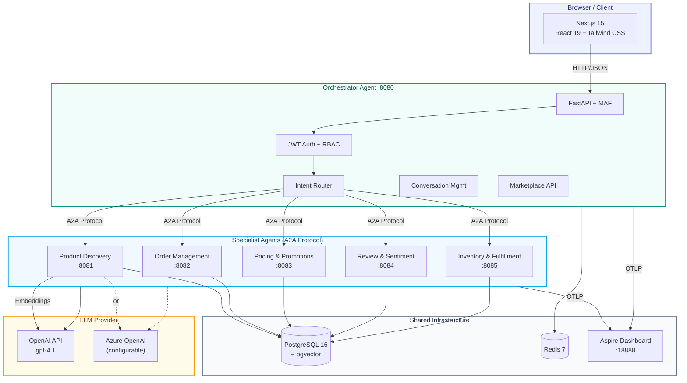

# E-Commerce Agents

[](LICENSE)
[](https://python.org)
[](https://nextjs.org)
[](https://docs.docker.com/compose/)

A **multi-agent e-commerce platform** built with [Microsoft Agent Framework](https://github.com/microsoft/agent-framework) (MAF) Python SDK. Six specialized AI agents collaborate via **A2A protocol** to handle product discovery, orders, pricing, reviews, inventory, and customer support.

Companion demo repo for the AI article series on [nitinksingh.com](https://nitinksingh.com).

---

## Architecture



---

## Quick Start

### Prerequisites

- [Docker](https://docs.docker.com/get-docker/) and Docker Compose
- An [OpenAI API key](https://platform.openai.com/api-keys) (or Azure OpenAI credentials)

### Setup

```bash
# 1. Clone the repo
git clone https://github.com/nitin27may/e-commerce-agents.git
cd e-commerce-agents

# 2. Configure environment
cp .env.example .env
# Edit .env — add your OPENAI_API_KEY (or Azure OpenAI credentials)

# 3. Start everything (builds, seeds, and starts all services)
./scripts/dev.sh
```

Open in your browser:
- **Frontend**: http://localhost:3000
- **Aspire Dashboard** (telemetry): http://localhost:18888

### Other Commands

```bash
./scripts/dev.sh --clean       # Nuke volumes, rebuild from scratch
./scripts/dev.sh --seed-only   # Re-run database seeder only
./scripts/dev.sh --infra-only  # Start db + redis + aspire only
```

---

## Test Users

Pre-seeded accounts for testing different roles:

| Email | Password | Role | Loyalty Tier |
|-------|----------|------|-------------|
| `admin.demo@gmail.com` | admin123 | Admin | Gold |
| `power.demo@gmail.com` | power123 | Power User | Gold |
| `seller.demo@gmail.com` | seller123 | Seller | Bronze |
| `alice.johnson@gmail.com` | customer123 | Customer | Gold |
| `bob.smith@gmail.com` | customer123 | Customer | Silver |

---

## Agent Catalog

| Agent | Port | Description | Key Tools |
|-------|------|-------------|-----------|
| **Customer Support** (Orchestrator) | 8080 | Routes requests to specialists via A2A | `call_specialist_agent` |
| **Product Discovery** | 8081 | Search, semantic search, comparisons, trending | `search_products`, `semantic_search`, `compare_products` |
| **Order Management** | 8082 | Order tracking, cancellation, returns, refunds | `get_user_orders`, `cancel_order`, `initiate_return` |
| **Pricing & Promotions** | 8083 | Coupon validation, cart optimization, loyalty | `validate_coupon`, `optimize_cart`, `get_active_deals` |
| **Review & Sentiment** | 8084 | Sentiment analysis, fake review detection | `analyze_sentiment`, `detect_fake_reviews` |
| **Inventory & Fulfillment** | 8085 | Stock, shipping estimates, fulfillment planning | `check_stock`, `estimate_shipping` |

---

## Demo Scenarios

Try these in the chat after logging in:

1. **Product Search**: "Find me wireless headphones under $300 with good noise cancellation"
2. **Comparison**: "Compare the Sony WH-1000XM5 with AirPods Max"
3. **Order Tracking**: "Where's my latest order?"
4. **Return Flow**: "I want to return my last order"
5. **Price Check**: "Is the Logitech MX Master 3S a good deal right now?"
6. **Review Analysis**: "What do people think about the Dyson V15?"
7. **Stock Check**: "Is the Dyson V15 Detect in stock?"
8. **Multi-Intent**: "Return my jacket and find me a warmer one under $200"

---

## Tech Stack

| Layer | Technology |
|-------|-----------|
| Agent Framework | [Microsoft Agent Framework](https://github.com/microsoft/agent-framework) v1.0 (Python SDK) |
| Agent Communication | A2A Protocol (HTTP) |
| LLM | OpenAI / Azure OpenAI (gpt-4.1) |
| Orchestrator | FastAPI (Python 3.12) |
| Database | PostgreSQL 16 + pgvector (1536-dim embeddings) |
| Cache | Redis 7 |
| Frontend | Next.js 15, React 19, Tailwind CSS, shadcn/ui |
| Auth | Self-contained JWT (PyJWT + bcrypt) |
| Telemetry | OpenTelemetry &rarr; .NET Aspire Dashboard |
| Package Managers | uv (Python), pnpm (Node) |
| Containerization | Docker Compose |

---

## Project Structure

```
e-commerce-agents/
├── docker-compose.yml               # 11 services with profiles
├── .env.example                     # Environment template
├── agents/                          # Python backend
│   ├── Dockerfile                   # Multi-target (ARG AGENT_NAME)
│   ├── pyproject.toml               # Dependencies (MAF, OTel, FastAPI)
│   ├── shared/                      # Shared library
│   │   ├── telemetry.py            # OTel auto-instrumentation
│   │   ├── config.py               # Pydantic Settings
│   │   ├── db.py                   # asyncpg connection pool
│   │   ├── auth.py                 # JWT + inter-agent auth
│   │   ├── agent_factory.py        # OpenAI / Azure client factory
│   │   ├── agent_host.py           # A2A-compatible agent host
│   │   ├── prompt_loader.py        # YAML prompt loader
│   │   └── tools/                  # Shared tool functions
│   ├── config/prompts/             # YAML prompt configs per agent
│   ├── orchestrator/               # Customer Support (:8080)
│   ├── product_discovery/          # Product Discovery (:8081)
│   ├── order_management/           # Order Management (:8082)
│   ├── pricing_promotions/         # Pricing & Promotions (:8083)
│   ├── review_sentiment/           # Review & Sentiment (:8084)
│   └── inventory_fulfillment/      # Inventory & Fulfillment (:8085)
├── docker/postgres/
│   └── init.sql                    # 24-table schema + pgvector
├── scripts/
│   ├── dev.sh                      # One-command dev setup
│   ├── seed.py                     # Database seeder
│   └── generate_embeddings.py      # Product embedding generation
├── web/                            # Next.js frontend
│   └── src/
│       ├── app/                    # 16 routes (App Router)
│       ├── components/             # UI components (shadcn/ui)
│       └── lib/                    # API client, auth context
└── docs/                           # Detailed documentation
    ├── architecture.md
    ├── api-reference.md
    ├── database-schema.md
    ├── telemetry.md
    ├── agent-flows.md
    └── deployment.md
```

---

## Configuration

Copy `.env.example` to `.env` and configure your LLM provider:

```bash
# OpenAI (default)
LLM_PROVIDER=openai
OPENAI_API_KEY=sk-...
LLM_MODEL=gpt-4.1

# Azure OpenAI (alternative)
LLM_PROVIDER=azure
AZURE_OPENAI_ENDPOINT=https://your-resource.openai.azure.com/
AZURE_OPENAI_KEY=...
AZURE_OPENAI_DEPLOYMENT=gpt-4.1
```

See [Deployment Guide](docs/deployment.md) for all configuration options.

---

## Documentation

| Document | Description |
|----------|-------------|
| [Architecture](docs/architecture.md) | System design, agent patterns, auth flow |
| [API Reference](docs/api-reference.md) | All REST endpoints with examples |
| [Database Schema](docs/database-schema.md) | 24 tables with ER diagram |
| [Telemetry](docs/telemetry.md) | OpenTelemetry setup and Aspire Dashboard |
| [Agent Flows](docs/agent-flows.md) | Multi-agent collaboration diagrams |
| [Deployment](docs/deployment.md) | Docker Compose, dev.sh, port map |

---

## Port Map

| Service | Port | URL |
|---------|------|-----|
| Frontend | 3000 | http://localhost:3000 |
| Orchestrator | 8080 | http://localhost:8080 |
| Product Discovery | 8081 | |
| Order Management | 8082 | |
| Pricing & Promotions | 8083 | |
| Review & Sentiment | 8084 | |
| Inventory & Fulfillment | 8085 | |
| Aspire Dashboard | 18888 | http://localhost:18888 |
| PostgreSQL | 5432 | |
| Redis | 6379 | |

---

## Contributing

1. Fork the repository
2. Create a feature branch: `git checkout -b feature/your-feature`
3. Make your changes and ensure tests pass
4. Submit a pull request

---

## License

This project is licensed under the [MIT License](LICENSE).

---

Built with [Microsoft Agent Framework](https://github.com/microsoft/agent-framework) and [A2A Protocol](https://google.github.io/A2A/).
