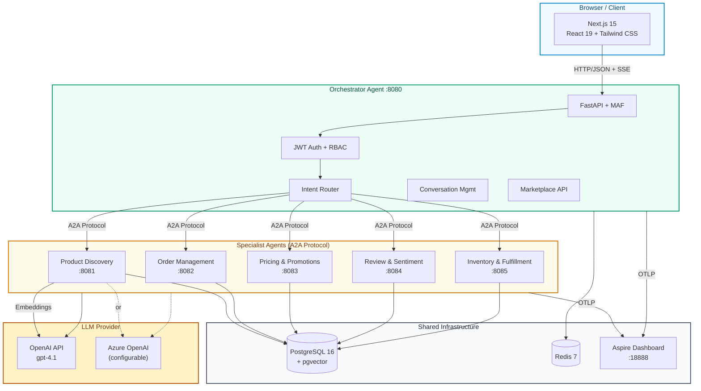

# AgentBazaar

**E-Commerce Multi-Agent Platform** built with [Microsoft Agent Framework](https://github.com/microsoft/agent-framework) (MAF) Python SDK.

6 specialized AI agents collaborate via **A2A protocol** to handle product discovery, orders, pricing, reviews, inventory, and customer support. Includes a marketplace layer with agent catalog, access requests, and admin approval workflows.

Companion demo repo for the AI article series on [nitinksingh.com](https://nitinksingh.com).

---

## Architecture



---

## Quick Start

```bash
# 1. Clone the repo
git clone https://github.com/nitin27may/e-commerce-agents.git
cd e-commerce-agents

# 2. Configure environment
cp .env.example .env
# Edit .env — add your OPENAI_API_KEY (or Azure OpenAI credentials)

# 3. Start everything
./scripts/dev.sh

# Open:
#   Frontend:        http://localhost:3000
#   Aspire Dashboard: http://localhost:18888
```

### Alternative Commands

```bash
./scripts/dev.sh --clean       # Nuke volumes, rebuild from scratch
./scripts/dev.sh --seed-only   # Re-run database seeder
./scripts/dev.sh --infra-only  # Start db + redis + aspire only
```

---

## Test Users (Pre-Seeded)

| Email | Password | Role | Loyalty Tier |
|-------|----------|------|-------------|
| admin@agentbazaar.com | admin123 | admin | Gold |
| power@agentbazaar.com | power123 | power_user | Gold |
| seller@agentbazaar.com | seller123 | seller | Bronze |
| alice@example.com | customer123 | customer | Gold |
| bob@example.com | customer123 | customer | Silver |

---

## Agent Catalog

| Agent | Port | Description | Key Tools |
|-------|------|-------------|-----------|
| **Customer Support** (Orchestrator) | 8080 | Routes requests to specialists via A2A | `call_specialist_agent` |
| **Product Discovery** | 8081 | Natural language search, semantic search, comparisons | `search_products`, `semantic_search`, `compare_products`, `get_trending_products` |
| **Order Management** | 8082 | Order tracking, cancellation, returns, refunds | `get_user_orders`, `cancel_order`, `initiate_return`, `process_refund` |
| **Pricing & Promotions** | 8083 | Coupon validation, cart optimization, loyalty discounts | `validate_coupon`, `optimize_cart`, `get_active_deals` |
| **Review & Sentiment** | 8084 | Sentiment analysis, fake review detection, trend tracking | `analyze_sentiment`, `detect_fake_reviews`, `get_sentiment_trend` |
| **Inventory & Fulfillment** | 8085 | Stock checking, shipping estimates, fulfillment planning | `check_stock`, `estimate_shipping`, `calculate_fulfillment_plan` |

---

## Demo Scenarios

Try these in the chat interface after logging in:

1. **Product Search**: "Find me wireless headphones under $300 with good noise cancellation"
2. **Comparison**: "Compare the Sony WH-1000XM5 with AirPods Max"
3. **Order Tracking**: "Where's my latest order?"
4. **Return Flow**: "I want to return my last order"
5. **Price Check**: "Is the Logitech MX Master 3S a good deal right now?"
6. **Review Analysis**: "What do people think about the Dyson V15?"
7. **Stock Check**: "Is the Dyson V15 Detect in stock?"
8. **Multi-Intent**: "Return my jacket and find me a warmer one under $200"

---

## Tech Stack

| Layer | Technology |
|-------|-----------|
| Agent Framework | Microsoft Agent Framework v1.0 (Python SDK) |
| Agent Communication | A2A Protocol (HTTP + SSE) |
| LLM | OpenAI / Azure OpenAI (gpt-4.1) |
| Orchestrator | FastAPI (Python 3.12) |
| Specialist Agents | Starlette via A2AAgentHost |
| Database | PostgreSQL 16 + pgvector (1536-dim embeddings) |
| Cache | Redis 7 |
| Frontend | Next.js 15, React 19, Tailwind CSS, shadcn/ui |
| Auth | Self-contained JWT (PyJWT + bcrypt) |
| Telemetry | OpenTelemetry -> .NET Aspire Dashboard |
| Package Managers | uv (Python), pnpm (Node) |
| Containerization | Docker Compose |

---

## Project Structure

```
e-commerce-agents/
├── README.md
├── PLAN.md                          # Phase-by-phase implementation tracker
├── CLAUDE.md                        # AI assistant instructions
├── docker-compose.yml               # 11 services with profiles
├── .env.example                     # Environment configuration template
│
├── agents/                          # Python backend
│   ├── Dockerfile                   # Multi-target (ARG AGENT_NAME)
│   ├── pyproject.toml               # Dependencies (MAF, OTel, FastAPI)
│   ├── shared/                      # Shared library
│   │   ├── telemetry.py            # OTel auto-instrumentation
│   │   ├── config.py               # Pydantic Settings
│   │   ├── db.py                   # asyncpg pool
│   │   ├── auth.py                 # JWT + inter-agent auth middleware
│   │   ├── jwt_utils.py            # Token creation/validation
│   │   ├── agent_factory.py        # LLM client factory
│   │   ├── context.py              # Request-scoped ContextVars
│   │   ├── context_providers.py    # MAF context injection
│   │   ├── usage_db.py             # Usage logging + trace correlation
│   │   └── tools/                  # Shared tool functions
│   │       ├── inventory_tools.py
│   │       ├── user_tools.py
│   │       ├── pricing_tools.py
│   │       ├── return_tools.py
│   │       └── loyalty_tools.py
│   ├── orchestrator/                # Customer Support (FastAPI, :8080)
│   ├── product_discovery/           # Product Discovery (:8081)
│   ├── order_management/            # Order Management (:8082)
│   ├── pricing_promotions/          # Pricing & Promotions (:8083)
│   ├── review_sentiment/            # Review & Sentiment (:8084)
│   └── inventory_fulfillment/       # Inventory & Fulfillment (:8085)
│
├── docker/
│   └── postgres/
│       └── init.sql                 # 24-table schema + pgvector
│
├── scripts/
│   ├── dev.sh                       # One-command dev setup
│   ├── seed.py                      # Database seeder (20 users, 50 products, ...)
│   └── generate_embeddings.py       # Product embedding generation
│
├── web/                             # Next.js frontend
│   ├── Dockerfile                   # Multi-stage standalone build
│   └── src/
│       ├── app/                     # 16 routes
│       ├── components/              # Sidebar + shadcn/ui
│       └── lib/                     # API client + auth context
│
└── docs/                            # Documentation
    ├── architecture.md
    ├── api-reference.md
    ├── database-schema.md
    ├── telemetry.md
    ├── agent-flows.md
    └── deployment.md
```

---

## UI Screenshots (Roles)

### All Roles
- `/chat` — Multi-agent chat with conversation history and agent badges
- `/products` — Product catalog with search, category filters, and sort
- `/products/[id]` — Product detail with specs, reviews, stock status, rating distribution
- `/orders` — Order history with status filters and color-coded badges
- `/orders/[id]` — Order detail with status timeline, items, shipping, returns
- `/marketplace` — Agent catalog with access request workflow
- `/profile` — User profile with loyalty tier, stats, and benefits

### Admin Only
- `/admin` — Dashboard with metrics, per-agent usage, 7-day trends
- `/admin/requests` — Access request management (approve/deny)
- `/admin/usage` — Detailed usage analytics
- `/admin/audit` — Audit log with expandable execution steps

---

## Documentation

| Document | Description |
|----------|-------------|
| [Architecture](docs/architecture.md) | System design, agent patterns, communication flow |
| [API Reference](docs/api-reference.md) | All REST endpoints with request/response examples |
| [Database Schema](docs/database-schema.md) | All 24 tables with ER diagram |
| [Telemetry](docs/telemetry.md) | OpenTelemetry setup, span hierarchy, Aspire Dashboard |
| [Agent Flows](docs/agent-flows.md) | Multi-agent collaboration flow diagrams |
| [Deployment](docs/deployment.md) | Docker Compose, environment config, dev.sh usage |

---

## LLM Provider Configuration

```bash
# OpenAI (default)
LLM_PROVIDER=openai
OPENAI_API_KEY=sk-...
LLM_MODEL=gpt-4.1

# Azure OpenAI
LLM_PROVIDER=azure
AZURE_OPENAI_ENDPOINT=https://your-resource.openai.azure.com/
AZURE_OPENAI_KEY=...
AZURE_OPENAI_DEPLOYMENT=gpt-4.1
AZURE_OPENAI_API_VERSION=2024-12-01-preview
```

---

## Port Map

| Service | Port | URL |
|---------|------|-----|
| Frontend | 3000 | http://localhost:3000 |
| Orchestrator | 8080 | http://localhost:8080 |
| Product Discovery | 8081 | http://localhost:8081 |
| Order Management | 8082 | http://localhost:8082 |
| Pricing & Promotions | 8083 | http://localhost:8083 |
| Review & Sentiment | 8084 | http://localhost:8084 |
| Inventory & Fulfillment | 8085 | http://localhost:8085 |
| Aspire Dashboard | 18888 | http://localhost:18888 |
| PostgreSQL | 5432 | localhost:5432 |
| Redis | 6379 | localhost:6379 |

---

## License

MIT

---

Built with [Microsoft Agent Framework](https://github.com/microsoft/agent-framework) and [A2A Protocol](https://a2a-protocol.org).
