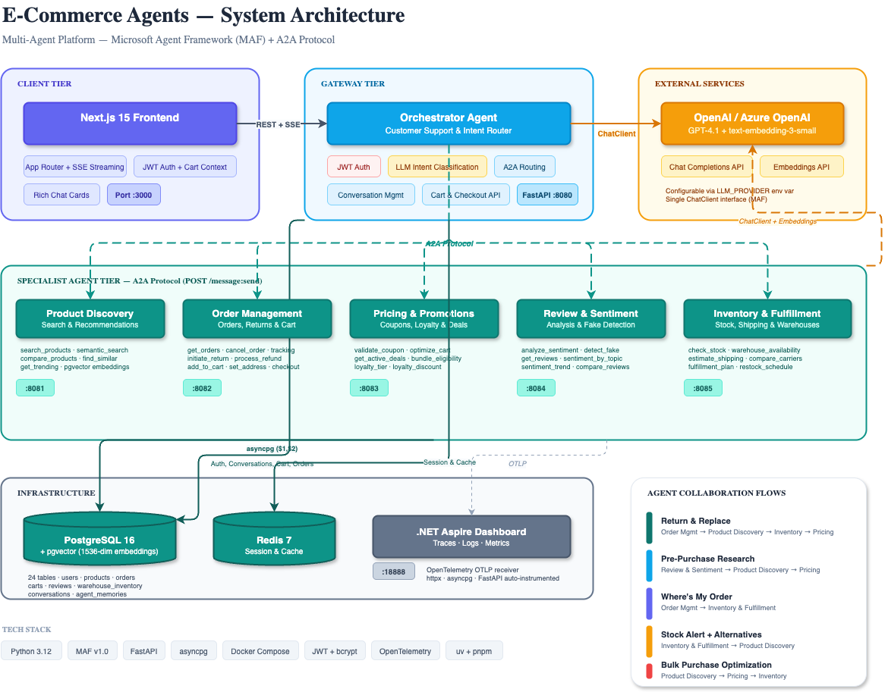
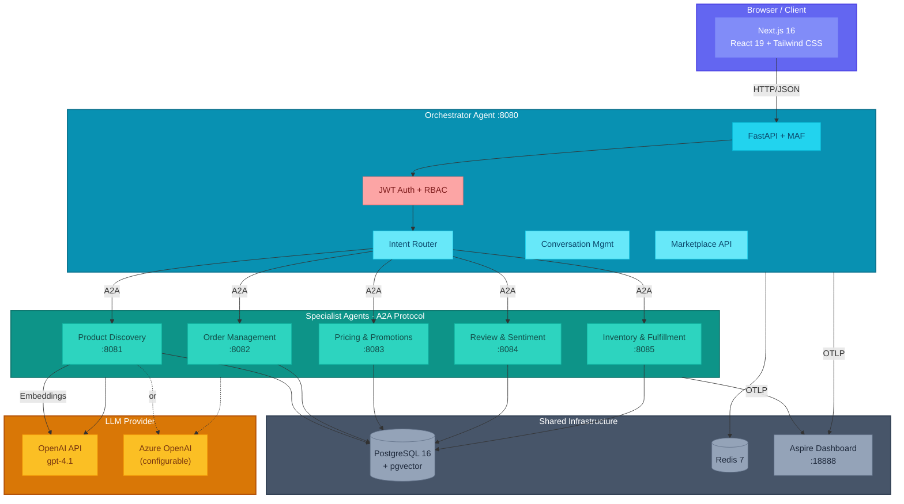
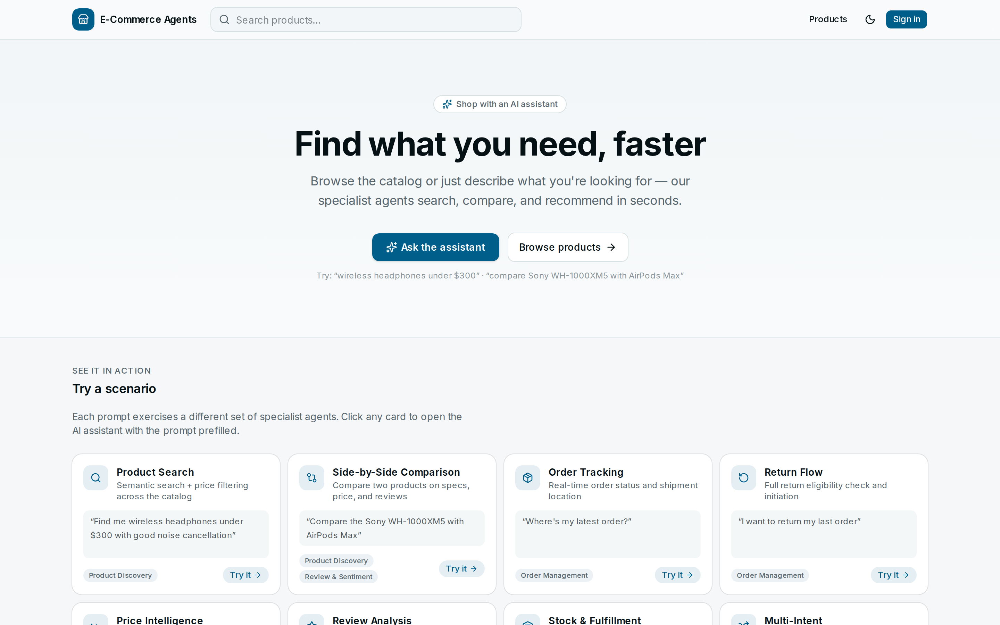
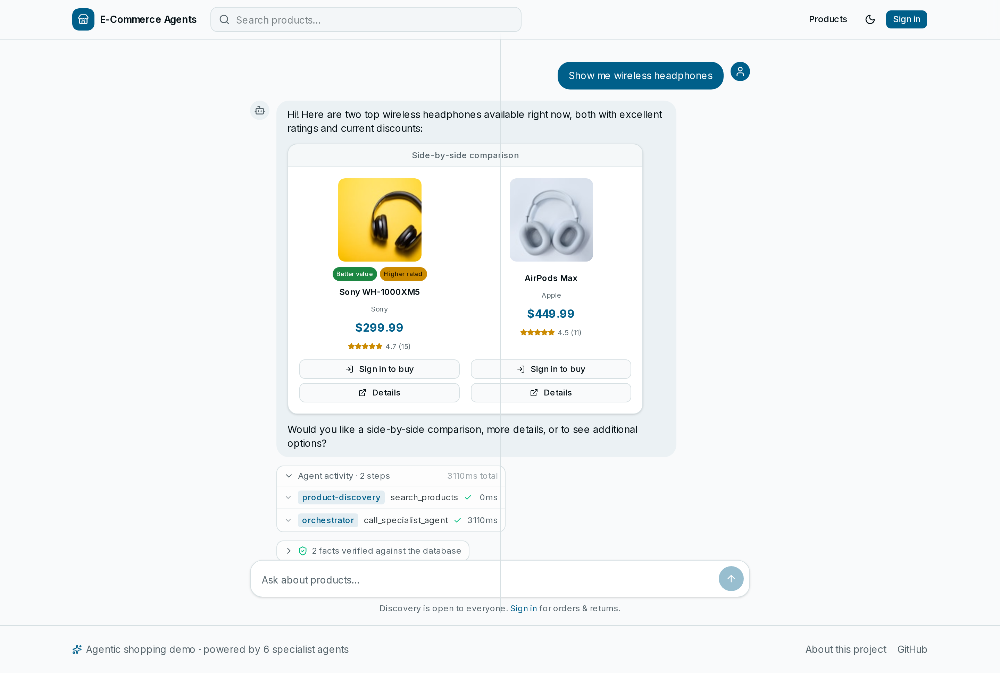
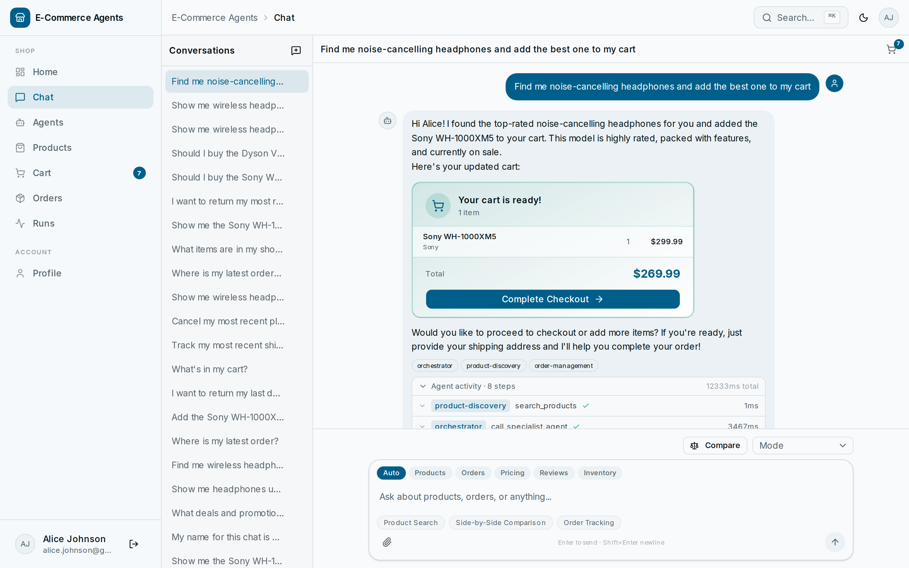
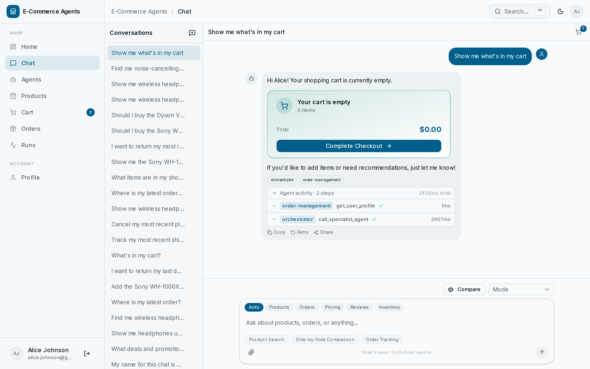
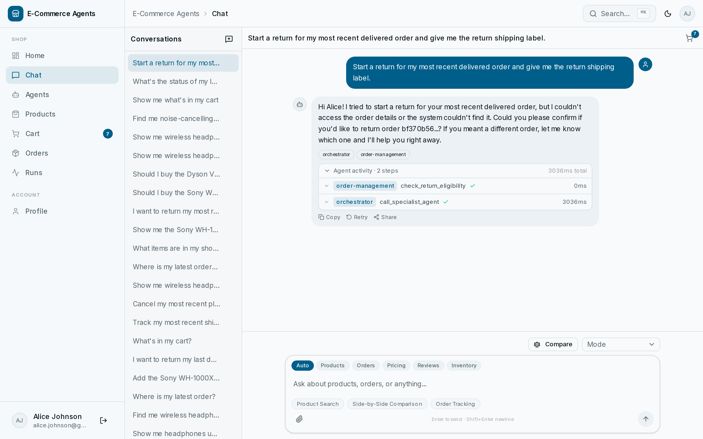

# E-Commerce Agents

[](https://github.com/nitin27may/e-commerce-agents/actions/workflows/tests.yml)
[](https://github.com/nitin27may/e-commerce-agents/actions/workflows/build-images.yml)
[](LICENSE)
[](https://python.org)
[](https://dotnet.microsoft.com)
[](https://nextjs.org)
[](https://github.com/microsoft/agent-framework)
[](https://github.com/pgvector/pgvector)
[](https://docs.docker.com/compose/)

A **multi-agent e-commerce platform** built with [Microsoft Agent Framework](https://github.com/microsoft/agent-framework) (MAF). Ships as **two complete, feature-parity backends — Python and .NET / C#** — both fully working implementations, not samples. Six specialized AI agents collaborate via **A2A protocol** to handle product discovery, orders, pricing, reviews, inventory, and customer support.

**Pick your stack:** [`agents/python/`](./agents/python/) (see [Quick Start → Python](#run-the-python-backend) below) or [`agents/dotnet/`](./agents/dotnet/) (see [Quick Start → .NET](#run-the-net-backend) below, or [`agents/dotnet/README.md`](./agents/dotnet/README.md)) — same database schema, same prompts, same Next.js frontend for either (toggle with `NEXT_PUBLIC_BACKEND_STACK`).

Companion demo repo for the AI article series on [nitinksingh.com](https://nitinksingh.com/posts/maf-v1-21-putting-it-all-together/).


---

## Where to start

| I want to... | Go here |
|---|---|
| Learn what an agent even is — new to AI/agents | [docs/concepts/](docs/concepts/) — start at page 01 |
| Run the Python backend locally | [Quick Start → Python](#run-the-python-backend) below |
| Run the .NET backend locally | [Quick Start → .NET](#run-the-net-backend) below |
| Understand how the agents work / add a new one | [Architecture](docs/architecture.md) · [Adding an Agent](docs/adding-an-agent.md) |
| Use the MCP server | [MCP Integration](docs/mcp-integration.md) |
| Follow the step-by-step tutorial series | [tutorials/README.md](./tutorials/README.md) |

---

## Quick Start

Both backends share the same setup, the same Postgres schema, and the same Next.js frontend —
only the compose file (and port-8080 orchestrator) differs. Pick one.

### Prerequisites

- [Docker](https://docs.docker.com/get-docker/) and Docker Compose
- An [OpenAI API key](https://platform.openai.com/api-keys) (or Azure OpenAI credentials)

### Setup (shared by both stacks)

```bash
# 1. Clone the repo
git clone https://github.com/nitin27may/e-commerce-agents.git
cd e-commerce-agents

# 2. Configure environment
cp .env.example .env
# Edit .env — add your OPENAI_API_KEY (or Azure OpenAI credentials)
```

### Run the Python backend

```bash
# Option A — helper script (builds, seeds, and starts everything):
./scripts/dev.sh

# Option B — plain Docker Compose (equivalent, no script):
docker compose --profile seed --profile agents --profile frontend up --build
```

### Run the .NET backend

```bash
# Option A — helper script:
./scripts/dev.sh --dotnet

# Option B — plain Docker Compose (equivalent, no script):
docker compose -f docker-compose.dotnet.yml \
  --profile seed --profile agents --profile mcp --profile frontend up --build
```

> Both compose files gate agents/frontend/seeder behind profiles — infra (`db`, `redis`, `aspire`)
> starts unconditionally, but a bare `docker compose up` (no `--profile` flags) only brings up
> infra. Use the commands above to get the full app.

Open in your browser (either stack):
- **Frontend**: http://localhost:3000
- **Aspire Dashboard** (telemetry): http://localhost:18888

### Other Commands

```bash
./scripts/dev.sh --clean               # Nuke volumes, rebuild from scratch
./scripts/dev.sh --seed-only           # Re-run database seeder only
./scripts/dev.sh --infra-only          # Start db + redis + aspire only
./scripts/dev.sh --clean --dotnet      # Same flags work with --dotnet too
```

---

## Table of Contents

- [Project Status](#project-status)
- [Learning Path](#learning-path--maf-v1-python-and-net)
- [Architecture](#architecture)
- [Screens](#screens)
- [Test Users](#test-users)
- [Agent Catalog](#agent-catalog)
- [Demo Scenarios](#demo-scenarios)
- [Tech Stack](#tech-stack)
- [Project Structure](#project-structure)
- [Configuration](#configuration)
- [Documentation](#documentation)
- [Port Map](#port-map)
- [Roadmap](#roadmap)
- [Contributing](#contributing)
- [License](#license)

---

## Project Status

**This is v1 — the Python version is live today.** It runs end-to-end: six specialist agents, orchestrator, auth, telemetry, and a full Next.js frontend.

The frontend is a **public, agentic e-commerce storefront**: anyone can browse the catalog, search, and use the AI shopping assistant (`/shop`) without an account — product discovery is served anonymously — while account flows (cart checkout, orders, tracking, returns) require sign-in. A built-in **agent-activity timeline** surfaces the multi-agent routing (orchestrator → specialist → tool) live in chat, backed by OpenTelemetry → .NET Aspire. Light/dark theming throughout.

The **.NET / C# port** for teams building in the Microsoft ecosystem lives at [`agents/dotnet/`](./agents/dotnet/) alongside the Python backend at [`agents/python/`](./agents/python/). Enhancement plans and the phased roadmap are tracked in [`.claude/plans/enhancements/`](./.claude/plans/enhancements/).

---

## Learning Path — *MAF v1: Python and .NET*

A new step-by-step tutorial series walks through **every Microsoft Agent Framework concept** — agents, tools, memory, middleware, workflow primitives, all five orchestration patterns, HITL, checkpoints, declarative workflows, visualization — with runnable examples in **both Python and .NET**. This repository is the capstone.

**Start here:** [`tutorials/README.md`](./tutorials/README.md)

| Tier | Chapters | Topics |
|------|----------|--------|
| 1 · Core Agent | [01–04](./tutorials/) | First agent · tools · streaming · sessions |
| 2 · Agent Internals | 05–08 | Context providers · middleware · OpenTelemetry · MCP |
| 3 · Workflow Foundations | 09–11 | Executors · edges · events · builder · agents in workflows |
| 4 · Orchestrations | 12–16 | Sequential · Concurrent · Handoff · Group Chat · Magentic |
| 5 · Advanced | 17–20 | HITL · checkpoints · declarative YAML · visualization |
| Capstone | 21 | Guided tour of this repo |

Each chapter has `python/`, `dotnet/`, `tests/`, and a Hugo-ready article draft (`README.md`). (`tutorials/_template/PLAN.md` is a template for authoring new chapters — individual chapters don't ship their own `PLAN.md`.) Chapters cross-post to [nitinksingh.com](https://nitinksingh.com) under the *MAF v1: Python and .NET* series, complementing the [original Python-only series](https://nitinksingh.com/posts/building-a-multi-agent-e-commerce-platform-the-complete-guide/).

---

## Architecture



<details>
<summary>View as Mermaid diagram</summary>


```mermaid
graph TB
    subgraph Client["Browser / Client"]
        FE["Next.js 16<br/>React 19 + Tailwind CSS"]
    end

    subgraph Orchestrator["Orchestrator Agent :8080"]
        FA["FastAPI + MAF"]
        AUTH["JWT Auth + RBAC"]
        ROUTER["Intent Router"]
        CONV["Conversation Mgmt"]
        MKT["Marketplace API"]
    end

    subgraph Specialists["Specialist Agents · A2A Protocol"]
        PD["Product Discovery<br/>:8081"]
        OM["Order Management<br/>:8082"]
        PP["Pricing &amp; Promotions<br/>:8083"]
        RS["Review &amp; Sentiment<br/>:8084"]
        IF["Inventory &amp; Fulfillment<br/>:8085"]
    end

    subgraph Infrastructure["Shared Infrastructure"]
        PG[("PostgreSQL 16<br/>+ pgvector")]
        RD[("Redis 7")]
        ASP["Aspire Dashboard<br/>:18888"]
    end

    subgraph LLM["LLM Provider"]
        OAI["OpenAI API<br/>gpt-4.1"]
        AZ["Azure OpenAI<br/>(configurable)"]
    end

    FE -->|"HTTP/JSON"| FA
    FA --> AUTH
    AUTH --> ROUTER
    ROUTER -->|"A2A"| PD
    ROUTER -->|"A2A"| OM
    ROUTER -->|"A2A"| PP
    ROUTER -->|"A2A"| RS
    ROUTER -->|"A2A"| IF

    PD --> PG
    OM --> PG
    PP --> PG
    RS --> PG
    IF --> PG

    PD -->|"Embeddings"| OAI
    PD -.->|"or"| AZ
    Orchestrator --> RD
    Specialists -->|"OTLP"| ASP

    Orchestrator -->|"OTLP"| ASP
    Specialists --> OAI
    Specialists -.-> AZ

    style Client fill:#6366f1,stroke:#4f46e5,stroke-width:2px,color:#fff
    style FE fill:#818cf8,stroke:#6366f1,color:#fff

    style Orchestrator fill:#0891b2,stroke:#0e7490,stroke-width:2px,color:#fff
    style FA fill:#22d3ee,stroke:#06b6d4,color:#0c4a6e
    style AUTH fill:#fca5a5,stroke:#f87171,color:#7f1d1d
    style ROUTER fill:#67e8f9,stroke:#22d3ee,color:#0c4a6e
    style CONV fill:#67e8f9,stroke:#22d3ee,color:#0c4a6e
    style MKT fill:#67e8f9,stroke:#22d3ee,color:#0c4a6e

    style Specialists fill:#0d9488,stroke:#0f766e,stroke-width:2px,color:#fff
    style PD fill:#2dd4bf,stroke:#14b8a6,color:#134e4a
    style OM fill:#2dd4bf,stroke:#14b8a6,color:#134e4a
    style PP fill:#2dd4bf,stroke:#14b8a6,color:#134e4a
    style RS fill:#2dd4bf,stroke:#14b8a6,color:#134e4a
    style IF fill:#2dd4bf,stroke:#14b8a6,color:#134e4a

    style Infrastructure fill:#475569,stroke:#334155,stroke-width:2px,color:#fff
    style PG fill:#94a3b8,stroke:#64748b,color:#1e293b
    style RD fill:#94a3b8,stroke:#64748b,color:#1e293b
    style ASP fill:#94a3b8,stroke:#64748b,color:#1e293b

    style LLM fill:#d97706,stroke:#b45309,stroke-width:2px,color:#fff
    style OAI fill:#fbbf24,stroke:#f59e0b,color:#78350f
    style AZ fill:#fbbf24,stroke:#f59e0b,color:#78350f
```
</details>

---

## Screens

<details open>
<summary>Screenshots — guest browsing, the AI shopping flow, and the platform (click to collapse)</summary>

### Guest experience (no login required)

Anyone can browse the catalog, use the AI shopping assistant, and explore product details without creating an account.

<table>
<tr><td></td></tr>
<tr><td align="center"><em>Product detail — full info, pricing, reviews, and stock status</em></td></tr>
<tr><td></td></tr>
<tr><td align="center"><em>AI shopping assistant — product questions answered via multi-agent routing, no login needed</em></td></tr>
</table>

### AI shopping flow (signed in)

Sign in as any seeded user to access cart, checkout, order tracking, and returns — all driven by natural language in the chat interface.

<table>
<tr><td></td></tr>
<tr><td align="center"><em>Find a product — orchestrator routes to Product Discovery; results render as interactive cards</em></td></tr>
<tr><td></td></tr>
<tr><td align="center"><em>Add to cart — ask the assistant; it calls the cart API and confirms with a card</em></td></tr>
<tr><td></td></tr>
<tr><td align="center"><em>View cart — the agent renders a cart summary with totals and a checkout link</em></td></tr>
<tr><td></td></tr>
<tr><td align="center"><em>Track an order — Order Management agent returns live status and shipment detail</em></td></tr>
<tr><td></td></tr>
<tr><td align="center"><em>Return / refund — agent initiates the return flow and issues a return label</em></td></tr>
</table>

### Platform

<table>
<tr><td></td></tr>
<tr><td align="center"><em>Agent timeline — orchestrator → specialist → tool routing surfaced live in chat</em></td></tr>
<tr><td></td></tr>
<tr><td align="center"><em>Product storefront — authenticated view with cart and account access</em></td></tr>
<tr><td></td></tr>
<tr><td align="center"><em>Agent marketplace — browse, request, and manage specialist agent access</em></td></tr>
<tr><td></td></tr>
<tr><td align="center"><em>Admin dashboard — usage analytics, approval queues, and audit log</em></td></tr>
<tr><td></td></tr>
<tr><td align="center"><em>Seller dashboard — product catalog and order management</em></td></tr>
</table>

</details>

---

## Test Users

Pre-seeded accounts for testing different roles:

| Email | Password | Role | Loyalty Tier |
|-------|----------|------|-------------|
| `admin.demo@gmail.com` | admin123 | Admin | Gold |
| `seller.demo@gmail.com` | seller123 | Seller | Bronze |
| `seller2.demo@gmail.com` | seller123 | Seller | Bronze |
| `alice.johnson@gmail.com` | customer123 | Customer | Gold |
| `bob.smith@gmail.com` | customer123 | Customer | Silver |

---

## Agent Catalog

| Agent | Port | Description | Key Tools |
|-------|------|-------------|-----------|
| **Customer Support** (Orchestrator) | 8080 | Routes requests to specialists via A2A | `call_specialist_agent` |
| **Product Discovery** | 8081 | Search, semantic search, comparisons, trending | `search_products`, `semantic_search`, `compare_products` |
| **Order Management** | 8082 | Order tracking, cancellation, returns, refunds | `get_user_orders`, `cancel_order`, `initiate_return` |
| **Pricing & Promotions** | 8083 | Coupon validation, cart optimization, loyalty | `validate_coupon`, `optimize_cart`, `get_active_deals` |
| **Review & Sentiment** | 8084 | Sentiment analysis, fake review detection | `analyze_sentiment`, `detect_fake_reviews` |
| **Inventory & Fulfillment** | 8085 | Stock, shipping estimates, fulfillment planning | `check_stock`, `estimate_shipping` |

---

## Demo Scenarios

Try these in the chat after logging in:

1. **Product Search**: "Find me wireless headphones under $300 with good noise cancellation"
2. **Comparison**: "Compare the Sony WH-1000XM5 with AirPods Max"
3. **Order Tracking**: "Where's my latest order?"
4. **Return Flow**: "I want to return my last order"
5. **Price Check**: "Is the Logitech MX Master 3S a good deal right now?"
6. **Review Analysis**: "What do people think about the Dyson V15?"
7. **Stock Check**: "Is the Dyson V15 Detect in stock?"
8. **Multi-Intent**: "Return my jacket and find me a warmer one under $200"

---

## Tech Stack

| Layer | Technology |
|-------|-----------|
| Agent Framework | [Microsoft Agent Framework](https://github.com/microsoft/agent-framework) v1.0 — Python SDK **and** .NET SDK (both backends fully implemented) |
| Agent Communication | A2A Protocol (HTTP) |
| LLM | OpenAI / Azure OpenAI (gpt-4.1) — plus any OpenAI-compatible endpoint (Ollama, LM Studio, vLLM, OpenRouter, GitHub Models) via `LLM_PROVIDER=openai` + `LLM_BASE_URL`, see [Setup](./tutorials/00-setup/) |
| Orchestrator | FastAPI (Python 3.12) · ASP.NET Core minimal APIs (.NET 10, C#) |
| Database | PostgreSQL 16 + pgvector (1536-dim embeddings) |
| Cache | Redis 7 |
| Frontend | Next.js 16, React 19, Tailwind CSS, shadcn/ui |
| Auth | Self-contained JWT (PyJWT + bcrypt) |
| Telemetry | OpenTelemetry → .NET Aspire Dashboard |
| Package Managers | uv (Python), pnpm (Node) |
| Containerization | Docker Compose |

---

## Project Structure

```
e-commerce-agents/
├── docker-compose.yml               # 11 services with profiles
├── .env.example                     # Environment template
├── agents/                          # Both backends live here
│   ├── python/                      # Python backend
│   │   ├── Dockerfile               # Multi-target agent image (ARG AGENT_NAME)
│   │   ├── Dockerfile.mcp           # Lean MCP server image (ARG MCP_PACKAGE)
│   │   ├── pyproject.toml           # Workspace root + dependencies (MAF, OTel, FastAPI)
│   │   ├── packages/                # Standalone publishable MCP server packages
│   │   │   ├── mcp-product/         # ecommerce-mcp-product (:9000)
│   │   │   └── mcp-inventory/       # ecommerce-mcp-inventory (:9001)
│   │   ├── shared/                  # Shared library (config, auth, DB, prompts, telemetry)
│   │   ├── config/prompts/          # YAML prompt configs (shared with .NET)
│   │   ├── orchestrator/            # Customer Support (:8080)
│   │   ├── product_discovery/       # Product Discovery (:8081)
│   │   ├── order_management/        # Order Management (:8082)
│   │   ├── pricing_promotions/      # Pricing & Promotions (:8083)
│   │   ├── review_sentiment/        # Review & Sentiment (:8084)
│   │   └── inventory_fulfillment/   # Inventory & Fulfillment (:8085)
│   └── dotnet/                      # .NET backend — parity with Python
│       ├── ECommerceAgents.sln
│       ├── Directory.Packages.props # Central package versions
│       └── src/
│           ├── ECommerceAgents.Shared/
│           ├── ECommerceAgents.Orchestrator/   # :8080
│           ├── ECommerceAgents.ProductDiscovery/
│           ├── ECommerceAgents.OrderManagement/
│           ├── ECommerceAgents.PricingPromotions/
│           ├── ECommerceAgents.ReviewSentiment/
│           └── ECommerceAgents.InventoryFulfillment/
├── docker/postgres/
│   └── init.sql                    # 24-table schema + pgvector
├── scripts/
│   ├── dev.sh                      # One-command dev setup
│   ├── seed.py                     # Database seeder
│   └── generate_embeddings.py      # Product embedding generation
├── web/                            # Next.js 16 frontend
│   └── src/
│       ├── app/                    # 16 routes (App Router)
│       ├── components/             # UI components (shadcn/ui)
│       └── lib/                    # API client, auth context
├── tutorials/                      # 22-chapter MAF v1 tutorial series (Python + .NET)
└── docs/                           # Full documentation — see docs/README.md
    ├── README.md                   # Docs index and reading order
    ├── architecture.md             # System design, agent patterns, A2A protocol
    ├── adding-an-agent.md          # Step-by-step guide to adding a specialist
    ├── api-reference.md            # All REST endpoints with examples
    ├── agent-flows.md              # Multi-agent collaboration sequence diagrams
    ├── database-schema.md          # 24 tables with ER diagram
    ├── deployment.md               # Docker Compose, dev.sh, environment config
    ├── frontend.md                 # Routes, theming, SSE/timeline, auth model
    ├── telemetry.md                # OpenTelemetry setup and Aspire Dashboard
    ├── mcp-integration.md          # MCP servers, setup, agent wiring
    ├── maf-best-practices.md       # MAF idioms: @tool, middleware, prompt YAML
    ├── security-guide.md           # Threat model, guardrails, hardening checklist
    ├── agent-quality.md            # Eval methodology, datasets, CI gate
    ├── agent-audit-matrix.md       # Per-agent security posture matrix
    └── troubleshooting.md          # Common local-stack issues and fixes
```

---

## Configuration

Copy `.env.example` to `.env` and configure your LLM provider:

```bash
# OpenAI (default)
LLM_PROVIDER=openai
OPENAI_API_KEY=sk-...
LLM_MODEL=gpt-4.1

# Azure OpenAI (alternative)
LLM_PROVIDER=azure
AZURE_OPENAI_ENDPOINT=https://your-resource.openai.azure.com/
AZURE_OPENAI_KEY=...
AZURE_OPENAI_DEPLOYMENT=gpt-4.1

# Local / self-hosted / free (Ollama, LM Studio, OpenRouter, vLLM, GitHub Models)
LLM_PROVIDER=openai
LLM_BASE_URL=http://localhost:11434/v1   # any OpenAI-compatible endpoint
OPENAI_API_KEY=ollama                    # any non-empty string for local servers
LLM_MODEL=qwen2.5:14b                    # a tool-calling-capable model
```

See [Setup — Chapter 00](tutorials/00-setup/README.md) for the full walkthrough (including a
tool-calling gotcha worth reading before picking a local model) and
[Deployment Guide](docs/deployment.md) for all configuration options.

---

## Documentation

| Document | Description |
|----------|-------------|
| [Architecture](docs/architecture.md) | System design, agent patterns, A2A protocol, auth flow |
| [Adding an Agent](docs/adding-an-agent.md) | Step-by-step guide to adding a specialist agent |
| [API Reference](docs/api-reference.md) | All REST endpoints with examples |
| [Database Schema](docs/database-schema.md) | 24 tables with ER diagram |
| [Telemetry](docs/telemetry.md) | OpenTelemetry setup and Aspire Dashboard |
| [Agent Flows](docs/agent-flows.md) | Multi-agent collaboration diagrams |
| [Deployment](docs/deployment.md) | Docker Compose, dev.sh, environment configuration |
| [Frontend](docs/frontend.md) | Routes, theming, SSE/timeline, public-vs-auth model |
| [Troubleshooting](docs/troubleshooting.md) | Common local-stack issues and fixes |
| [Contributing](CONTRIBUTING.md) | Setup, conventions, testing policy, PR checklist |
| [Security Guide](docs/security-guide.md) | Threat model, guardrails stack, auth, SQL controls |
| [Agent Quality & Evals](docs/agent-quality.md) | Eval methodology, datasets, red-team suite, CI gate |
| [Agent Audit Matrix](docs/agent-audit-matrix.md) | Per-agent security posture and open hardening items |
| [MAF Best Practices](docs/maf-best-practices.md) | MAF idioms: @tool, middleware, prompt YAML, ContextVars |
| [MCP Integration](docs/mcp-integration.md) | MCP servers (FastMCP), MCPStreamableHTTPTool wiring, enable/disable |

---

## Port Map

| Service | Port | URL |
|---------|------|-----|
| Frontend | 3000 | http://localhost:3000 |
| Orchestrator | 8080 | http://localhost:8080 |
| Product Discovery | 8081 | |
| Order Management | 8082 | |
| Pricing & Promotions | 8083 | |
| Review & Sentiment | 8084 | |
| Inventory & Fulfillment | 8085 | |
| Aspire Dashboard | 18888 | http://localhost:18888 |
| PostgreSQL | 5432 | |
| Redis | 6379 | |
| MCP Product | 9000 | http://localhost:9000/mcp (when `--profile mcp`) |
| MCP Inventory | 9001 | http://localhost:9001/mcp (when `--profile mcp`) |

---

## Roadmap

This is v1. The Python platform is live and stable. The .NET port is also available.

Legend: `- [x]` shipped · `- [ ]` planned or in progress.

### Shipped in v1

- [x] **Agent evaluators** — scripted eval sets (precision@k, recall@k, answer faithfulness, tool-call correctness) across all six specialists, run against the seeded catalog. `.github/workflows/evals.yml` is `workflow_dispatch`-only today — run it manually from the Actions tab (or `gh workflow run evals.yml`) whenever an `OPENAI_API_KEY` secret is available; there is no automatic schedule yet, and it deliberately isn't a PR gate (LLM calls are slow and non-deterministic). A PR-blocking smoke gate (a fast subset of the suite) is planned but not yet implemented.
- [x] **Prompt injection prevention** — `shared/guardrails/` wired into the middleware stack for all agents. Enabled by default (`GUARDRAILS_ENABLED=true`); runs in observe-first mode (`GUARDRAILS_FAIL_OPEN=true`) — flags and logs injections. Set `GUARDRAILS_BLOCK_ON_INJECTION=true` to enable hard blocking once false-positive rates are measured in your environment.
- [x] **Session memory & context persistence** — `store_memory` / `recall_memories` tools in `shared/tools/memory_tools.py`, surfaced to the orchestrator via `shared/context_providers.py`. Per-user preferences, recent intents, and history make follow-ups feel continuous.
- [x] **Full .NET / C# port** — same six specialist agents plus an MCP server, same A2A protocol and PostgreSQL schema, idiomatic .NET throughout. Nine test projects, ~191 tests. See [`agents/dotnet/`](./agents/dotnet/).
- [x] **Observability dashboards** — pre-built Aspire Dashboard views for agent latency, tool error rates, and LLM token spend per specialist.
- [x] **MCP data-access layer (2 servers)** — `mcp-product` (:9000) and `mcp-inventory` (:9001) are standalone, independently publishable Python packages (`packages/mcp-product`, `packages/mcp-inventory`) in a uv workspace. They expose product and inventory data over the MCP streamable HTTP transport (FastMCP). Flag-gated via `MCP_ENABLED`; `product-discovery` and `inventory-fulfillment` swap their direct-asyncpg `@tool` set for `MCPStreamableHTTPTool` with no behavior change. Any MCP-compatible client — Claude Desktop, Cursor, LangGraph — can use them without this codebase. See [MCP Integration](docs/mcp-integration.md).
- [x] **Self-hosted OAuth2 Authorization Server** — opt-in `AUTH_MODE=oauth` path with the token issuer living *inside* this repo (`agents/python/auth_server/`, built on `authlib`), so login and every service call are genuinely OAuth2-compliant with no external identity provider or cloud dependency. RS256 signing with an AS-generated keypair and a JWKS endpoint; user login via the resource-owner-password grant brokered by the orchestrator (the browser keeps its email/password form); client-credentials service tokens replacing the static A2A shared secret; and both MCP servers hardened into OAuth 2.1 resource servers (audience/scope validation, `.well-known/oauth-protected-resource`, `WWW-Authenticate` challenge) — Python and .NET parity throughout. Fully additive — `AUTH_MODE=local` (self-issued JWT + shared secret) stays the zero-config default, so the OpenAI-key-only quick-start is unaffected. Verified end to end against a live stack: real browser login and chat session on AS-issued tokens, role-gated routes, inter-agent and MCP calls authenticated purely on OAuth scopes (no shared secrets), and cross-scope/cross-resource token rejection — both stacks, including the .NET MCP host validated against the real running auth-server. See [`.claude/plans/enhancements/10-oauth-authorization.md`](.claude/plans/enhancements/10-oauth-authorization.md).

### In Progress

- [ ] **Human-in-the-loop approval flows** — backend approval endpoints and admin review UI are complete (`/api/admin/hitl/requests`). The remaining piece is the in-chat agent-pause card: the agent suspends mid-task, renders an approval prompt in the UI, and resumes once an operator confirms. High-stakes actions (refunds over threshold, inventory writes, bulk price changes) are the first targets.
- [ ] **Per-agent cost tracking** — per-specialist token counts are persisted in the database (`shared/usage_db.py`) and surfaced on the admin usage page. The remaining piece is first-class OpenTelemetry metrics (token + dollar cost per specialist as OTLP counters), so the Aspire Dashboard and any OTLP sink can alert on spend anomalies.
- [ ] **Streaming tool calls end-to-end** — text-delta streaming is live and product/order cards render progressively as the LLM generates the response. The remaining piece is propagating raw tool-result payloads as separate SSE frames so cards can appear before the text completes.

---

### Planned — Search & Retrieval

The product catalog has 1536-dim pgvector embeddings but `search_products` still uses `ILIKE` matching. Planned:

- [ ] **Postgres full-text search** — `tsvector` column + GIN index, `plainto_tsquery` + `ts_rank` to replace the `ILIKE` loop.
- [ ] **Hybrid retrieval (FTS + vector)** — combine lexical and semantic scores via Reciprocal Rank Fusion in a single CTE.
- [ ] **Smarter tool routing** — update `product-discovery.yaml` so the LLM routes vague descriptive queries to `semantic_search` and attribute-driven queries to `search_products`.
- [ ] **Typed filter DSL** — replace the flat parameter list on `search_products` with a structured `ProductFilters` Pydantic model (category, price, brand, sort). Keeps SQL parameterized and safe.

Text-to-SQL was considered and rejected: `user_email`/`user_role` scoping via ContextVars means dynamic SQL would bypass that contract. The typed filter DSL gives the model flexibility at the boundary while keeping SQL generation server-side and auditable.

---

### MCP as the Agent Data-Access Layer

| Server | Port | Domain |
|--------|------|--------|
| `mcp-product` | 9000 | Product search, details, comparison, trending, price history |
| `mcp-inventory` | 9001 | Stock levels, warehouses, shipping, carriers |

Both are standalone publishable packages in a uv workspace (`packages/mcp-product`, `packages/mcp-inventory`). Start them with:

```bash
docker compose --profile mcp --profile agents up

# then set in .env
MCP_ENABLED=true
MCP_PRODUCT_SERVER_URL=http://localhost:9000/mcp
MCP_INVENTORY_SERVER_URL=http://localhost:9001/mcp
```

See [MCP Integration](docs/mcp-integration.md) for the full setup guide, tool coverage table, external client examples (Claude Desktop, LangGraph), and publishing instructions.

Planned:

- [ ] **External integration surface** — publish `ecommerce-mcp-product` and `ecommerce-mcp-inventory` to PyPI so any MCP-compatible client can `pip install` and run them against any PostgreSQL database without this codebase.
- [ ] **Eval gate** — run each eval dataset twice (native tools vs MCP path) and fail CI if the MCP run scores below the native baseline.

---

### Planned — Platform & Observability

- [ ] **Prompt caching** — cache system prompts and tool schemas per agent to reduce per-request token cost on repeated specialist invocations.

---

## Contributing

1. Fork the repository
2. Create a feature branch: `git checkout -b feature/your-feature`
3. Make your changes and ensure tests pass
4. Submit a pull request

See [CONTRIBUTING.md](CONTRIBUTING.md) for detailed setup, conventions, testing policy, and PR checklist.

---

## License

This project is licensed under the [MIT License](LICENSE).

---

Built with [Microsoft Agent Framework](https://github.com/microsoft/agent-framework) and [A2A Protocol](https://google.github.io/A2A/).
