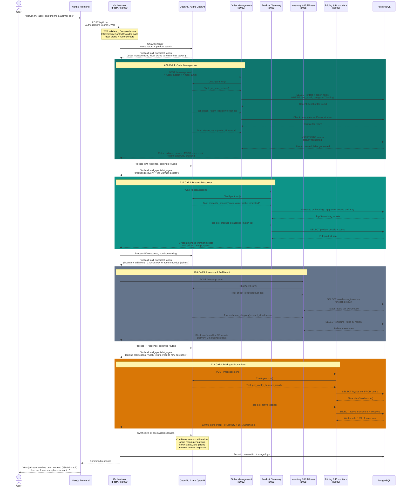
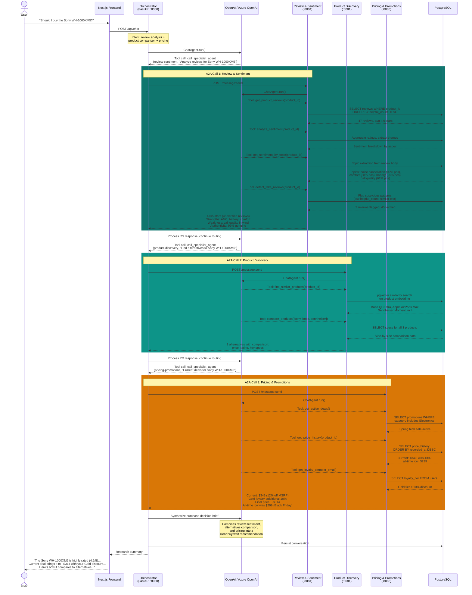
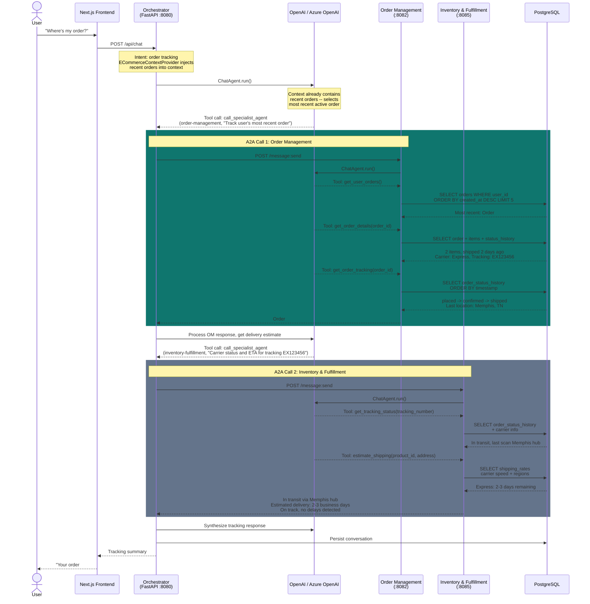
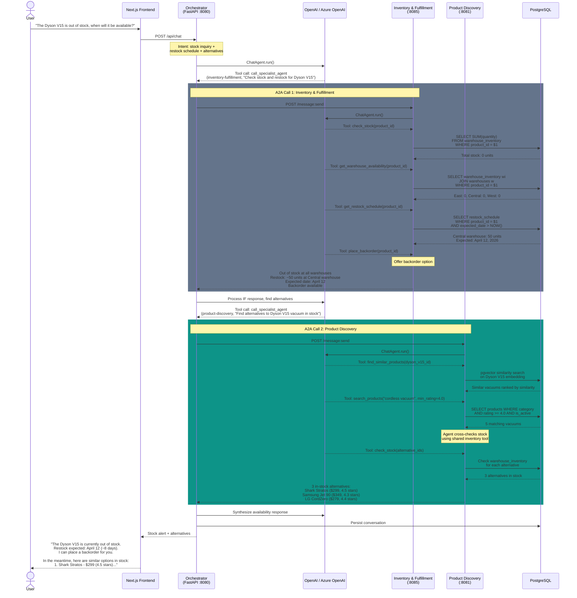
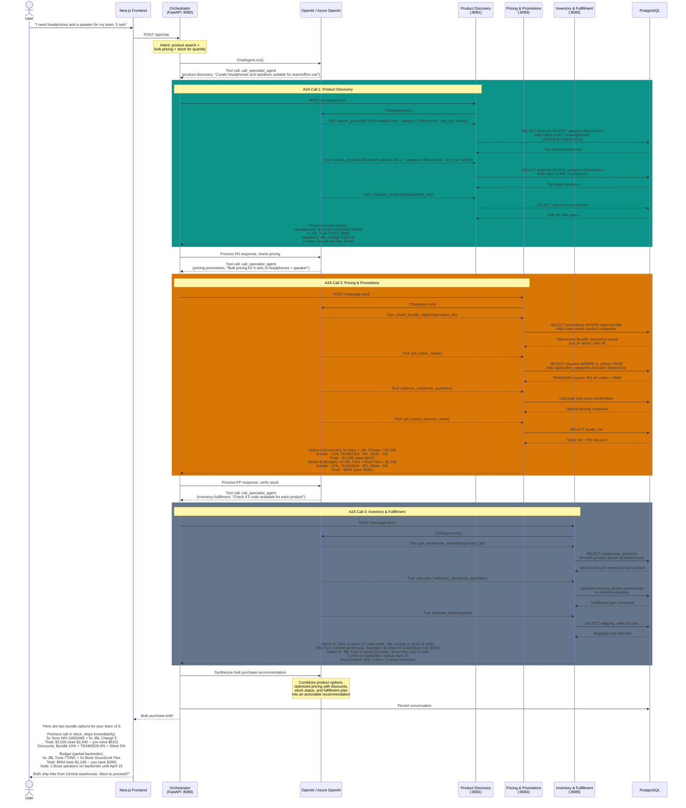

# Agent Collaboration Flows

Detailed sequence diagrams for five multi-agent collaboration scenarios in AgentBazaar. Each flow demonstrates how the Orchestrator classifies intent, routes to multiple specialist agents via A2A protocol, and synthesizes a unified response.

---

## Flow 1: Return and Replace

**User**: "Return my jacket and find me a warmer one"

This flow spans four agents: Order Management checks return eligibility and initiates the return, Product Discovery finds warmer alternatives, Inventory confirms stock, and Pricing applies any return credit.

---

## Flow 2: Pre-Purchase Research

**User**: "Should I buy the Sony WH-1000XM5?"

This research flow calls Review & Sentiment for opinion analysis, Product Discovery for alternatives, and Pricing & Promotions for current deals -- giving the user a complete purchase decision brief.

---

## Flow 3: Where's My Order

**User**: "Where's my order?"

A focused two-agent flow: Order Management retrieves order details and tracking, then Inventory & Fulfillment checks the real-time carrier status and delivery estimate.

---

## Flow 4: Stock Alert

**User**: "The Dyson V15 is out of stock, when will it be available?"

Inventory & Fulfillment checks stock levels and restock schedules, then Product Discovery finds in-stock alternatives if the wait is too long.

---

## Flow 5: Bulk Purchase Optimization

**User**: "I need headphones and a speaker for my team, 5 sets"

Product Discovery curates options, Pricing calculates bulk discounts and applicable coupons, and Inventory confirms stock availability for the requested quantity across warehouses.

---

## Flow Summary

| Flow | Agents Involved | Key Pattern |
|------|----------------|-------------|
| **Return and Replace** | Order Management -> Product Discovery -> Inventory -> Pricing | Sequential chain: action (return) then search then verify then optimize |
| **Pre-Purchase Research** | Review & Sentiment -> Product Discovery -> Pricing | Parallel research: gather opinions, alternatives, and deals |
| **Where's My Order** | Order Management -> Inventory & Fulfillment | Focused: order data then carrier/delivery status |
| **Stock Alert** | Inventory & Fulfillment -> Product Discovery | Fallback pattern: check stock, find alternatives when unavailable |
| **Bulk Purchase** | Product Discovery -> Pricing -> Inventory | Full pipeline: curate, price-optimize, verify fulfillment |

### Common Patterns Across Flows

- **Context injection**: Every agent receives user profile and recent orders via `ECommerceContextProvider` before processing. This enables personalization (loyalty tier, purchase history) without the user repeating themselves.
- **Shared tools**: Agents can call tools outside their primary domain. Product Discovery calls `check_stock()` (shared inventory tool) to avoid recommending out-of-stock items. This reduces unnecessary A2A round-trips.
- **Sequential A2A**: The Orchestrator calls specialists one at a time. Each response informs the next call's message. This is intentional -- later agents need context from earlier results (e.g., Pricing needs to know which products were recommended).
- **LLM synthesis**: The Orchestrator's LLM doesn't just concatenate specialist responses. It synthesizes them into a natural, coherent message with clear structure and actionable next steps.
- **Identity propagation**: User identity flows via `X-User-Email` and `X-User-Role` headers on every A2A call, then into ContextVars. Every tool query filters by user -- there's no data leakage between customers.
