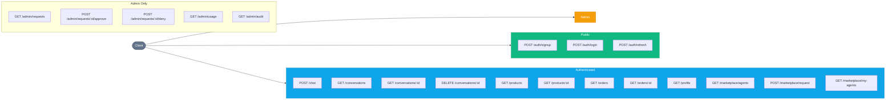

# API Reference

AgentBazaar exposes 20 REST endpoints through the orchestrator service (FastAPI, port 8080). All endpoints are prefixed with `/api/`.

## Route Overview



## Authentication

All authenticated endpoints require a `Bearer` token in the `Authorization` header:

```
Authorization: Bearer <access_token>
```

Tokens are JWTs signed with `JWT_SECRET` (PyJWT + bcrypt). Access tokens contain `sub` (email), `role`, `user_id`, and `type: "access"`. Refresh tokens contain `sub` and `type: "refresh"`.

Admin endpoints additionally verify `role == "admin"` and return `403` if the check fails.

---

## Auth (Public)

### POST /api/auth/signup

Create a new user account and receive tokens.

| Field | Value |
|-------|-------|
| Auth  | Public |

**Request Body**

```json
{
  "email": "alice@example.com",
  "password": "securepassword",
  "name": "Alice Johnson"
}
```

**Response** `200`

```json
{
  "access_token": "eyJhbGciOi...",
  "refresh_token": "eyJhbGciOi...",
  "user": {
    "id": "550e8400-e29b-41d4-a716-446655440000",
    "email": "alice@example.com",
    "name": "Alice Johnson",
    "role": "customer",
    "loyalty_tier": "bronze",
    "total_spend": 0.0
  }
}
```

**Errors**
- `409` Email already registered

---

### POST /api/auth/login

Authenticate an existing user and receive tokens.

| Field | Value |
|-------|-------|
| Auth  | Public |

**Request Body**

```json
{
  "email": "alice@example.com",
  "password": "securepassword"
}
```

**Response** `200`

```json
{
  "access_token": "eyJhbGciOi...",
  "refresh_token": "eyJhbGciOi...",
  "user": {
    "id": "550e8400-e29b-41d4-a716-446655440000",
    "email": "alice@example.com",
    "name": "Alice Johnson",
    "role": "customer",
    "loyalty_tier": "gold",
    "total_spend": 4200.0
  }
}
```

**Errors**
- `401` Invalid email or password
- `403` Account is deactivated

---

### POST /api/auth/refresh

Exchange a refresh token for a new access token.

| Field | Value |
|-------|-------|
| Auth  | Public (requires valid refresh token in body) |

**Request Body**

```json
{
  "refresh_token": "eyJhbGciOi..."
}
```

**Response** `200`

```json
{
  "access_token": "eyJhbGciOi..."
}
```

**Errors**
- `401` Refresh token expired / invalid / wrong type
- `403` Account is deactivated

---

## Chat

### POST /api/chat

Send a message to the orchestrator agent. The orchestrator routes to specialist agents as needed and returns the consolidated response.

| Field | Value |
|-------|-------|
| Auth  | JWT Required |

**Request Body**

```json
{
  "message": "What are the best noise-cancelling headphones under $350?",
  "conversation_id": null
}
```

`conversation_id` is optional. Omit or pass `null` to start a new conversation. Pass an existing ID to continue a conversation (loads the last 50 messages as context).

**Response** `200`

```json
{
  "response": "I found several great options for noise-cancelling headphones under $350...",
  "conversation_id": "a1b2c3d4-e5f6-7890-abcd-ef1234567890",
  "agents_involved": ["orchestrator", "product-discovery", "pricing-promotions"]
}
```

**Errors**
- `401` Missing/invalid token
- `404` Conversation not found (if `conversation_id` is provided but doesn't belong to the user)

---

## Conversations

### GET /api/conversations

List the authenticated user's conversations, ordered by most recent activity.

| Field | Value |
|-------|-------|
| Auth  | JWT Required |

**Response** `200`

```json
[
  {
    "id": "a1b2c3d4-e5f6-7890-abcd-ef1234567890",
    "title": "What are the best noise-cancelling headphones under $350?",
    "message_count": 4,
    "created_at": "2026-04-01T10:30:00+00:00",
    "last_message_at": "2026-04-01T10:35:22+00:00"
  }
]
```

Returns up to 50 active conversations. Soft-deleted conversations are excluded.

---

### GET /api/conversations/{conversation_id}

Get a single conversation with its full message history.

| Field | Value |
|-------|-------|
| Auth  | JWT Required |

**Response** `200`

```json
{
  "id": "a1b2c3d4-e5f6-7890-abcd-ef1234567890",
  "title": "What are the best noise-cancelling headphones under $350?",
  "created_at": "2026-04-01T10:30:00+00:00",
  "last_message_at": "2026-04-01T10:35:22+00:00",
  "messages": [
    {
      "id": "msg-uuid-1",
      "role": "user",
      "content": "What are the best noise-cancelling headphones under $350?",
      "agent_name": null,
      "agents_involved": [],
      "metadata": {},
      "tokens_in": 0,
      "tokens_out": 0,
      "created_at": "2026-04-01T10:30:00+00:00"
    },
    {
      "id": "msg-uuid-2",
      "role": "assistant",
      "content": "I found several great options...",
      "agent_name": "orchestrator",
      "agents_involved": ["orchestrator", "product-discovery"],
      "metadata": {},
      "tokens_in": 150,
      "tokens_out": 320,
      "created_at": "2026-04-01T10:30:05+00:00"
    }
  ]
}
```

**Errors**
- `404` Conversation not found or doesn't belong to the user

---

### DELETE /api/conversations/{conversation_id}

Soft-delete a conversation (sets `is_active = FALSE`). Messages are preserved in the database.

| Field | Value |
|-------|-------|
| Auth  | JWT Required |

**Response** `200`

```json
{
  "status": "deleted"
}
```

**Errors**
- `404` Conversation not found or doesn't belong to the user

---

## Products

### GET /api/products

Browse and search the product catalog with filtering and sorting.

| Field | Value |
|-------|-------|
| Auth  | JWT Required |

**Query Parameters**

| Parameter   | Type    | Default   | Description |
|-------------|---------|-----------|-------------|
| `category`  | string  | -         | Filter by category (Electronics, Clothing, Home, Sports, Books) |
| `min_price` | float   | -         | Minimum price filter |
| `max_price` | float   | -         | Maximum price filter |
| `search`    | string  | -         | ILIKE search against product name and description |
| `sort`      | string  | `rating`  | Sort order: `rating`, `price_asc`, `price_desc`, `newest`, `name` |
| `limit`     | int     | `50`      | Page size |
| `offset`    | int     | `0`       | Pagination offset |

**Response** `200`

```json
{
  "products": [
    {
      "id": "prod-uuid-1",
      "name": "Sony WH-1000XM5",
      "description": "Premium wireless noise-cancelling headphones with 30-hour battery...",
      "category": "Electronics",
      "brand": "Sony",
      "price": 299.99,
      "original_price": 349.99,
      "image_url": "/images/products/sony-wh1000xm5.jpg",
      "rating": 4.7,
      "review_count": 12
    }
  ],
  "total": 50,
  "categories": ["Books", "Clothing", "Electronics", "Home", "Sports"]
}
```

Product descriptions are truncated to 200 characters in the list view.

---

### GET /api/products/{product_id}

Get full product details including specs, stock levels, reviews, and rating distribution.

| Field | Value |
|-------|-------|
| Auth  | JWT Required |

**Response** `200`

```json
{
  "id": "prod-uuid-1",
  "name": "Sony WH-1000XM5",
  "description": "Premium wireless noise-cancelling headphones with 30-hour battery life...",
  "category": "Electronics",
  "brand": "Sony",
  "price": 299.99,
  "original_price": 349.99,
  "image_url": "/images/products/sony-wh1000xm5.jpg",
  "rating": 4.7,
  "review_count": 12,
  "specs": {
    "type": "Over-ear",
    "battery": "30 hours",
    "noise_cancelling": true,
    "weight": "250g",
    "connectivity": "Bluetooth 5.2"
  },
  "in_stock": true,
  "total_stock": 145,
  "warehouses": [
    { "name": "East", "region": "east", "quantity": 50 },
    { "name": "Central", "region": "central", "quantity": 65 },
    { "name": "West", "region": "west", "quantity": 30 }
  ],
  "reviews": [
    {
      "id": "review-uuid-1",
      "rating": 5,
      "title": "Best headphones I've owned",
      "body": "The noise cancellation is incredible...",
      "verified": true,
      "reviewer": "Alice Johnson",
      "date": "2026-03-15T14:20:00+00:00"
    }
  ],
  "rating_distribution": {
    "1": 1,
    "2": 0,
    "3": 2,
    "4": 3,
    "5": 6
  }
}
```

**Errors**
- `404` Product not found

---

## Orders

### GET /api/orders

List the authenticated user's orders. Filterable by status.

| Field | Value |
|-------|-------|
| Auth  | JWT Required |

**Query Parameters**

| Parameter | Type   | Default | Description |
|-----------|--------|---------|-------------|
| `status`  | string | -       | Filter by status: placed, confirmed, shipped, out_for_delivery, delivered, cancelled, returned |
| `limit`   | int    | `20`    | Page size |
| `offset`  | int    | `0`     | Pagination offset |

**Response** `200`

```json
{
  "orders": [
    {
      "id": "order-uuid-1",
      "status": "delivered",
      "total": 349.98,
      "carrier": "Express",
      "tracking": "EXP-12345-US",
      "item_count": 2,
      "date": "2026-03-20T09:15:00+00:00"
    }
  ],
  "total": 8
}
```

---

### GET /api/orders/{order_id}

Get full order details including line items, status history, shipping address, and return info.

| Field | Value |
|-------|-------|
| Auth  | JWT Required |

**Response** `200`

```json
{
  "id": "order-uuid-1",
  "status": "delivered",
  "total": 349.98,
  "shipping_address": {
    "street": "123 Main St",
    "city": "New York",
    "state": "NY",
    "zip": "10001",
    "country": "US"
  },
  "carrier": "Express",
  "tracking": "EXP-12345-US",
  "coupon": "SAVE10",
  "discount": 35.0,
  "date": "2026-03-20T09:15:00+00:00",
  "items": [
    {
      "product_id": "prod-uuid-1",
      "name": "Sony WH-1000XM5",
      "category": "Electronics",
      "image_url": "/images/products/sony-wh1000xm5.jpg",
      "quantity": 1,
      "unit_price": 299.99,
      "subtotal": 299.99
    }
  ],
  "status_history": [
    {
      "status": "placed",
      "notes": "Order received",
      "location": null,
      "timestamp": "2026-03-20T09:15:00+00:00"
    },
    {
      "status": "delivered",
      "notes": "Delivered to front door",
      "location": "New York, NY",
      "timestamp": "2026-03-23T14:30:00+00:00"
    }
  ],
  "return": null
}
```

When a return exists, the `return` field contains:

```json
{
  "id": "return-uuid-1",
  "reason": "Defective product",
  "status": "refunded",
  "refund_method": "original_payment",
  "refund_amount": 299.99,
  "created_at": "2026-03-25T10:00:00+00:00",
  "resolved_at": "2026-03-28T16:00:00+00:00"
}
```

**Errors**
- `404` Order not found or doesn't belong to the user

---

## Profile

### GET /api/profile

Get the authenticated user's profile, including loyalty tier benefits and activity counts.

| Field | Value |
|-------|-------|
| Auth  | JWT Required |

**Response** `200`

```json
{
  "id": "user-uuid-1",
  "email": "alice@example.com",
  "name": "Alice Johnson",
  "role": "customer",
  "loyalty_tier": "gold",
  "total_spend": 4200.0,
  "member_since": "2025-12-01T00:00:00+00:00",
  "order_count": 15,
  "review_count": 8,
  "tier_benefits": {
    "discount_pct": 10.0,
    "free_shipping_threshold": 25.0,
    "priority_support": true
  }
}
```

**Errors**
- `404` User not found

---

## Marketplace

### GET /api/marketplace/agents

List all active agents in the marketplace catalog.

| Field | Value |
|-------|-------|
| Auth  | JWT Required |

**Response** `200`

```json
[
  {
    "id": "agent-uuid-1",
    "name": "product-discovery",
    "display_name": "Product Discovery",
    "description": "Searches products by keyword, category, price range, and semantic similarity.",
    "category": "Shopping",
    "icon": "search",
    "status": "active",
    "version": "1.0",
    "capabilities": ["search", "recommend", "compare"],
    "requires_approval": true,
    "allowed_roles": ["power_user", "admin"]
  }
]
```

---

### POST /api/marketplace/request

Submit an access request for a specific agent.

| Field | Value |
|-------|-------|
| Auth  | JWT Required |

**Request Body**

```json
{
  "agent_name": "product-discovery",
  "role_requested": "power_user",
  "use_case": "I need advanced product search capabilities for comparison shopping."
}
```

**Response** `200` (pending approval)

```json
{
  "id": "req-uuid-1",
  "agent_name": "product-discovery",
  "status": "pending",
  "message": "Your request has been submitted and is pending admin approval."
}
```

**Response** `200` (auto-approved, when `requires_approval = false`)

```json
{
  "id": "req-uuid-1",
  "agent_name": "product-discovery",
  "status": "approved",
  "message": "Access granted automatically — no approval required."
}
```

**Errors**
- `404` Agent not found
- `409` Pending request already exists for this agent
- `409` User already has access to this agent

---

### GET /api/marketplace/my-agents

List agents the authenticated user has been granted access to.

| Field | Value |
|-------|-------|
| Auth  | JWT Required |

**Response** `200`

```json
[
  {
    "agent_name": "product-discovery",
    "display_name": "Product Discovery",
    "description": "Searches products by keyword, category, price range, and semantic similarity.",
    "category": "Shopping",
    "icon": "search",
    "role": "power_user",
    "granted_at": "2026-03-01T12:00:00+00:00"
  }
]
```

---

## Admin

All admin endpoints require `role: "admin"` in the JWT. Non-admin users receive `403 Admin access required`.

### GET /api/admin/requests

List all pending access requests across all users.

| Field | Value |
|-------|-------|
| Auth  | Admin Only |

**Response** `200`

```json
[
  {
    "id": "req-uuid-1",
    "agent_name": "product-discovery",
    "role_requested": "power_user",
    "use_case": "I need advanced product search capabilities.",
    "status": "pending",
    "created_at": "2026-04-01T08:00:00+00:00",
    "user_email": "bob@example.com",
    "user_name": "Bob Smith",
    "user_role": "customer"
  }
]
```

---

### POST /api/admin/requests/{request_id}/approve

Approve a pending access request. Creates the corresponding `agent_permissions` record in a transaction.

| Field | Value |
|-------|-------|
| Auth  | Admin Only |

**Request Body**

```json
{
  "admin_notes": "Approved for trial period."
}
```

`admin_notes` is optional (defaults to empty string).

**Response** `200`

```json
{
  "status": "approved",
  "request_id": "req-uuid-1"
}
```

**Errors**
- `404` Request not found
- `409` Request already approved/denied

---

### POST /api/admin/requests/{request_id}/deny

Deny a pending access request.

| Field | Value |
|-------|-------|
| Auth  | Admin Only |

**Request Body**

```json
{
  "admin_notes": "Insufficient justification."
}
```

**Response** `200`

```json
{
  "status": "denied",
  "request_id": "req-uuid-1"
}
```

**Errors**
- `404` Request not found
- `409` Request already approved/denied

---

### GET /api/admin/usage

Get aggregate usage statistics for the last 30 days, with per-agent breakdowns and a 7-day daily trend.

| Field | Value |
|-------|-------|
| Auth  | Admin Only |

**Response** `200`

```json
{
  "period": "last_30_days",
  "overall": {
    "total_requests": 1250,
    "unique_users": 18,
    "total_tokens_in": 450000,
    "total_tokens_out": 680000,
    "avg_duration_ms": 2300,
    "total_tool_calls": 3400
  },
  "by_agent": [
    {
      "agent_name": "orchestrator",
      "request_count": 500,
      "unique_users": 18,
      "tokens_in": 180000,
      "tokens_out": 250000,
      "avg_duration_ms": 2100,
      "error_count": 5
    },
    {
      "agent_name": "product-discovery",
      "request_count": 320,
      "unique_users": 15,
      "tokens_in": 95000,
      "tokens_out": 150000,
      "avg_duration_ms": 1800,
      "error_count": 2
    }
  ],
  "daily_trend": [
    {
      "day": "2026-04-04",
      "request_count": 85,
      "unique_users": 12
    },
    {
      "day": "2026-04-03",
      "request_count": 92,
      "unique_users": 14
    }
  ]
}
```

---

### GET /api/admin/audit

Get a detailed audit log from `usage_logs` with associated `agent_execution_steps` for each entry.

| Field | Value |
|-------|-------|
| Auth  | Admin Only |

**Query Parameters**

| Parameter | Type | Default | Description |
|-----------|------|---------|-------------|
| `limit`   | int  | `50`    | Page size (max 200) |
| `offset`  | int  | `0`     | Pagination offset |

**Response** `200`

```json
{
  "entries": [
    {
      "id": "log-uuid-1",
      "agent_name": "orchestrator",
      "user_email": "alice@example.com",
      "user_name": "Alice Johnson",
      "input_summary": "What are the best headphones?",
      "tokens_in": 150,
      "tokens_out": 420,
      "tool_calls_count": 2,
      "duration_ms": 2450,
      "status": "success",
      "error_message": null,
      "trace_id": "4bf92f3577b34da6a3ce929d0e0e4736",
      "created_at": "2026-04-04T10:15:00+00:00",
      "steps": [
        {
          "step_index": 0,
          "tool_name": "call_specialist_agent",
          "tool_input": { "agent_name": "product-discovery" },
          "tool_output": { "result": "Found 3 matching products..." },
          "status": "success",
          "duration_ms": 1200
        }
      ]
    }
  ],
  "total": 1250,
  "limit": 50,
  "offset": 0
}
```

The `trace_id` field correlates with OpenTelemetry traces in the Aspire Dashboard, allowing drill-down from audit log to distributed traces.

---

## Error Response Format

All error responses follow FastAPI's standard format:

```json
{
  "detail": "Description of the error"
}
```

| Status Code | Meaning |
|-------------|---------|
| `401`       | Missing, expired, or invalid JWT |
| `403`       | Insufficient permissions (e.g., non-admin accessing admin routes) |
| `404`       | Resource not found or doesn't belong to the authenticated user |
| `409`       | Conflict (duplicate email, duplicate access request, already resolved request) |
