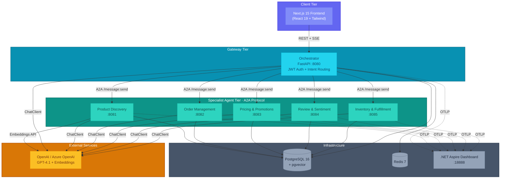
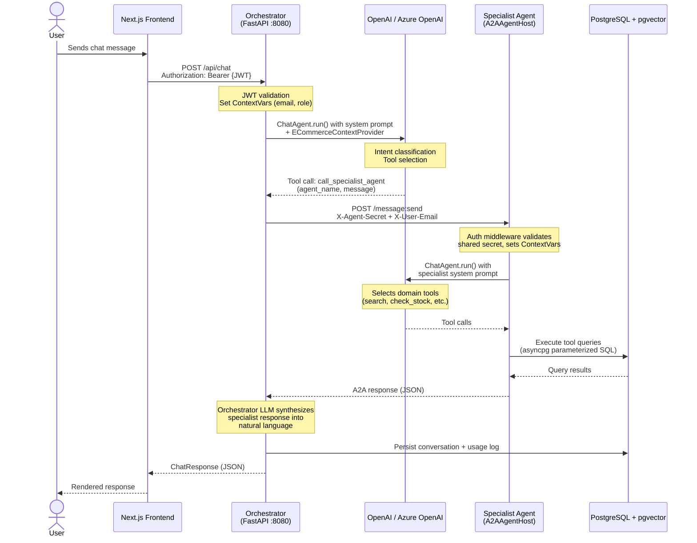
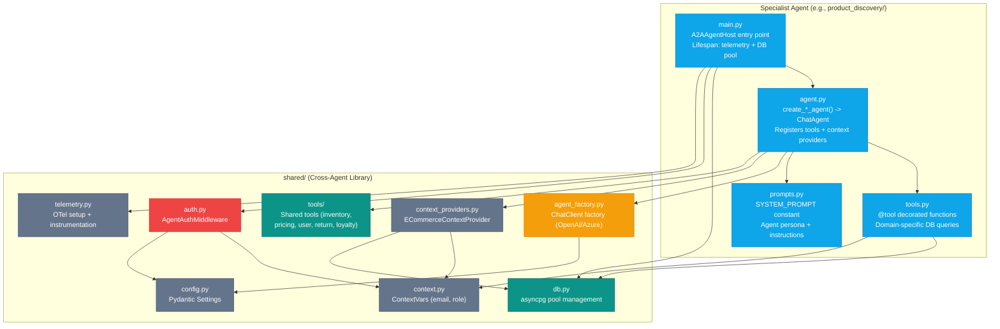
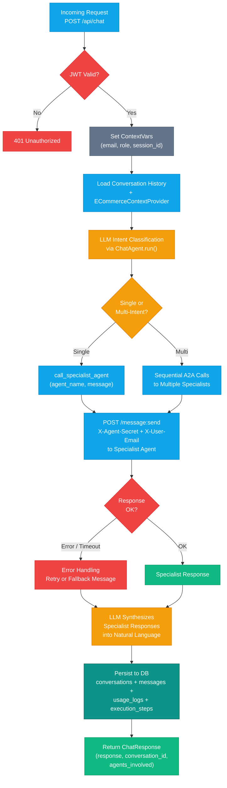
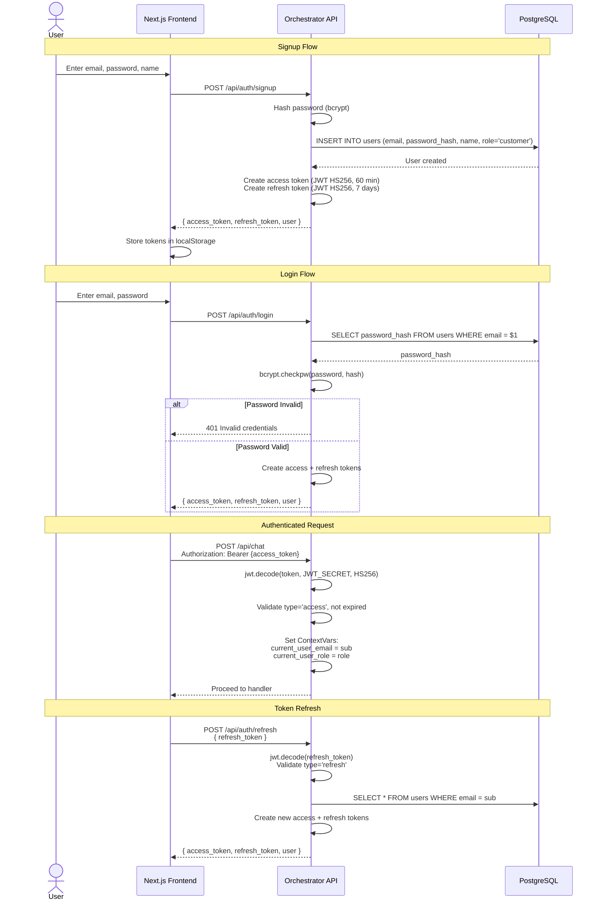
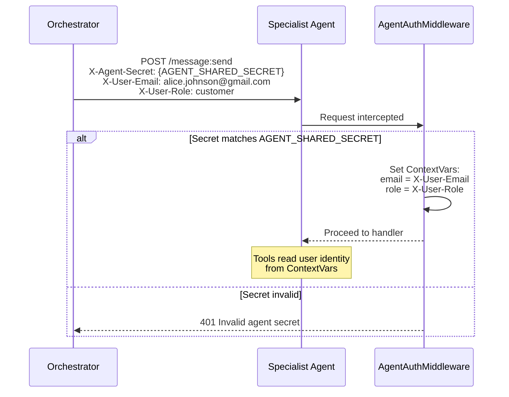

# Architecture

E-Commerce Agents is a multi-agent e-commerce platform built on Microsoft Agent Framework (MAF). Six specialized agents collaborate via A2A protocol, orchestrated by a central Customer Support agent that classifies user intent and routes requests to the right specialist.

---

## 1. System Overview

The platform comprises three tiers: a Next.js frontend, a FastAPI orchestrator gateway backed by five specialist agents, and shared infrastructure (PostgreSQL + pgvector, Redis, .NET Aspire Dashboard).

---

## 2. Agent Communication Pattern

All user requests enter through the Orchestrator. The Orchestrator classifies intent, calls one or more specialist agents via A2A, and synthesizes a unified response.

---

## 3. Agent Architecture

Every specialist agent follows a consistent four-file structure. The Orchestrator is the only agent that uses FastAPI directly -- all specialists use `A2AAgentHost` from the MAF A2A library.

### Agent Inventory

| Agent | Port | Module | Key Tools |
|-------|------|--------|-----------|
| **Orchestrator** | 8080 | `orchestrator/` | `call_specialist_agent` (A2A router) |
| **Product Discovery** | 8081 | `product_discovery/` | `search_products`, `semantic_search`, `compare_products`, `find_similar_products`, `get_trending_products` |
| **Order Management** | 8082 | `order_management/` | `get_user_orders`, `get_order_details`, `get_order_tracking`, `cancel_order`, `modify_order`, `check_return_eligibility`, `initiate_return`, `process_refund` |
| **Pricing & Promotions** | 8083 | `pricing_promotions/` | `validate_coupon`, `optimize_cart`, `get_active_deals`, `check_bundle_eligibility`, `get_loyalty_tier`, `calculate_loyalty_discount` |
| **Review & Sentiment** | 8084 | `review_sentiment/` | `get_product_reviews`, `analyze_sentiment`, `get_sentiment_by_topic`, `get_sentiment_trend`, `detect_fake_reviews`, `compare_product_reviews` |
| **Inventory & Fulfillment** | 8085 | `inventory_fulfillment/` | `check_stock`, `get_warehouse_availability`, `get_restock_schedule`, `estimate_shipping`, `compare_carriers`, `calculate_fulfillment_plan`, `place_backorder` |

---

## 4. Orchestrator Pattern

The Orchestrator is the single entry point for all user traffic. It handles authentication, intent classification via LLM, agent routing via A2A, and conversation persistence.

---

## 5. Auth Flow

E-Commerce Agents uses self-contained JWT authentication (PyJWT + bcrypt). There is no external identity provider. Inter-agent calls use a shared secret instead of JWT.

### User Authentication

### Inter-Agent Authentication

### RBAC Roles

| Role | Access Level | Description |
|------|-------------|-------------|
| `customer` | Default | Standard shopping, orders, reviews |
| `power_user` | Extended | Access to advanced agent features via marketplace |
| `seller` | Seller tools | Draft review responses, view sentiment reports |
| `admin` | Full | Approve access requests, manage agent catalog, all operations |

---

## 6. Data Flow

End-to-end data flow showing how a user request traverses the system, from initial HTTP request through agent processing to database persistence.

```mermaid
flowchart LR
    subgraph Input["Request"]
        USER_MSG["User Message<br/>'Find me wireless headphones<br/>under $200 with good reviews'"]
    end

    subgraph Auth["Authentication"]
        JWT_CHECK["JWT Decode<br/>HS256 Validation"]
        CTX_SET["ContextVars Set<br/>email + role"]
    end

    subgraph Orchestration["Orchestration Layer"]
        CTX_LOAD["Context Loaded<br/>User profile + recent orders<br/>(ECommerceContextProvider)"]
        LLM_ROUTE["LLM Classifies Intent<br/>-> product-discovery<br/>-> review-sentiment"]
    end

    subgraph A2A_1["Product Discovery Agent"]
        PD_LLM["ChatAgent selects tools"]
        PD_SEARCH["semantic_search()<br/>Embed query -> pgvector"]
        PD_FILTER["search_products()<br/>category + price filter"]
        PD_STOCK["check_stock()<br/>Cross-check inventory"]
    end

    subgraph A2A_2["Review & Sentiment Agent"]
        RS_LLM["ChatAgent selects tools"]
        RS_REVIEWS["get_product_reviews()"]
        RS_SENT["analyze_sentiment()<br/>Rating breakdown + themes"]
    end

    subgraph Synthesis["Response Synthesis"]
        COMBINE["Orchestrator LLM combines:<br/>- Product results<br/>- Stock status<br/>- Review summaries<br/>into natural language"]
    end

    subgraph Persist["Persistence"]
        CONV["conversations table"]
        MSG["messages table<br/>(user + assistant)"]
        USAGE["usage_logs table<br/>+ execution_steps"]
    end

    subgraph Output["Response"]
        RESP["ChatResponse<br/>Products + reviews + stock<br/>agents_involved: [product-discovery,<br/>review-sentiment]"]
    end

    USER_MSG --> JWT_CHECK
    JWT_CHECK --> CTX_SET
    CTX_SET --> CTX_LOAD
    CTX_LOAD --> LLM_ROUTE

    LLM_ROUTE -->|"A2A call 1"| PD_LLM
    PD_LLM --> PD_SEARCH
    PD_LLM --> PD_FILTER
    PD_LLM --> PD_STOCK

    LLM_ROUTE -->|"A2A call 2"| RS_LLM
    RS_LLM --> RS_REVIEWS
    RS_LLM --> RS_SENT

    PD_SEARCH --> COMBINE
    PD_FILTER --> COMBINE
    PD_STOCK --> COMBINE
    RS_REVIEWS --> COMBINE
    RS_SENT --> COMBINE

    COMBINE --> CONV
    COMBINE --> MSG
    COMBINE --> USAGE
    COMBINE --> RESP

    style USER_MSG fill:#0ea5e9,stroke:#0284c7,color:#fff
    style JWT_CHECK fill:#ef4444,stroke:#dc2626,color:#fff
    style CTX_SET fill:#64748b,stroke:#475569,color:#fff
    style CTX_LOAD fill:#0ea5e9,stroke:#0284c7,color:#fff
    style LLM_ROUTE fill:#f59e0b,stroke:#d97706,color:#fff
    style PD_LLM fill:#f59e0b,stroke:#d97706,color:#fff
    style PD_SEARCH fill:#0ea5e9,stroke:#0284c7,color:#fff
    style PD_FILTER fill:#0ea5e9,stroke:#0284c7,color:#fff
    style PD_STOCK fill:#0ea5e9,stroke:#0284c7,color:#fff
    style RS_LLM fill:#f59e0b,stroke:#d97706,color:#fff
    style RS_REVIEWS fill:#0ea5e9,stroke:#0284c7,color:#fff
    style RS_SENT fill:#0ea5e9,stroke:#0284c7,color:#fff
    style COMBINE fill:#f59e0b,stroke:#d97706,color:#fff
    style CONV fill:#0d9488,stroke:#115e59,color:#fff
    style MSG fill:#0d9488,stroke:#115e59,color:#fff
    style USAGE fill:#0d9488,stroke:#115e59,color:#fff
    style RESP fill:#10b981,stroke:#059669,color:#fff
```

---

## 7. Technology Decisions

| Decision | Choice | Rationale |
|----------|--------|-----------|
| **Agent Framework** | Microsoft Agent Framework (MAF) Python SDK | First-class `ChatAgent` abstraction with `@tool` decorators, `ContextProvider`, and built-in A2A support. Avoids hand-rolling function-calling loops. |
| **Inter-Agent Protocol** | A2A via `agent-framework-a2a` | Standard protocol for agent-to-agent communication. Each specialist exposes `/message:send`. Decoupled from transport -- could swap HTTP for gRPC later. |
| **LLM Provider** | OpenAI / Azure OpenAI (configurable) | Single `ChatClient` interface via MAF. Swap with `LLM_PROVIDER` env var. Azure for production (managed identity, RBAC); OpenAI for local dev. |
| **Database** | PostgreSQL 16 + pgvector | Single database for relational data and vector embeddings. `text-embedding-3-small` (1536 dims) for semantic product search. IVFFlat index for fast cosine similarity. |
| **Web Framework** | FastAPI (orchestrator) + Starlette (specialists) | FastAPI for the orchestrator because it needs REST endpoints (auth, chat, marketplace, admin). Specialists use the lighter `A2AAgentHost` which wraps Starlette. |
| **Auth** | Self-contained JWT (HS256) + bcrypt | No external IdP dependency for the demo. Access tokens (60 min) + refresh tokens (7 days). Inter-agent auth via shared secret header. |
| **User Context** | Python ContextVars | Request-scoped state (email, role) set by auth middleware, read by any `@tool` function. No need to pass user info through function parameters. |
| **DB Access** | asyncpg (raw SQL) | Maximum control over queries. No ORM overhead. Parameterized `$1, $2` syntax prevents SQL injection. Connection pool (5-20) per agent. |
| **Telemetry** | OpenTelemetry -> .NET Aspire Dashboard | Auto-instrumented: httpx (LLM + A2A calls), asyncpg (DB queries), FastAPI/Starlette (HTTP). Custom spans for A2A calls and tool execution. All correlate via trace_id. |
| **Cache** | Redis 7 | Session data and conversation state caching. Alpine image for minimal footprint. |
| **Frontend** | Next.js 15 + React 19 + Tailwind + shadcn/ui | Server Components by default, `pnpm` for package management. Minimal client-side JS. |
| **Containerization** | Docker Compose + multi-target Dockerfile | All 6 agents share one Dockerfile with `ARG AGENT_NAME`. Each agent is a separate service with its own port. Single `docker compose up --build` to start everything. |
| **Package Management** | `uv` (Python) + `pnpm` (Node) | `uv` for fast dependency resolution and virtual environment management. `pnpm` for disk-efficient node_modules. |
