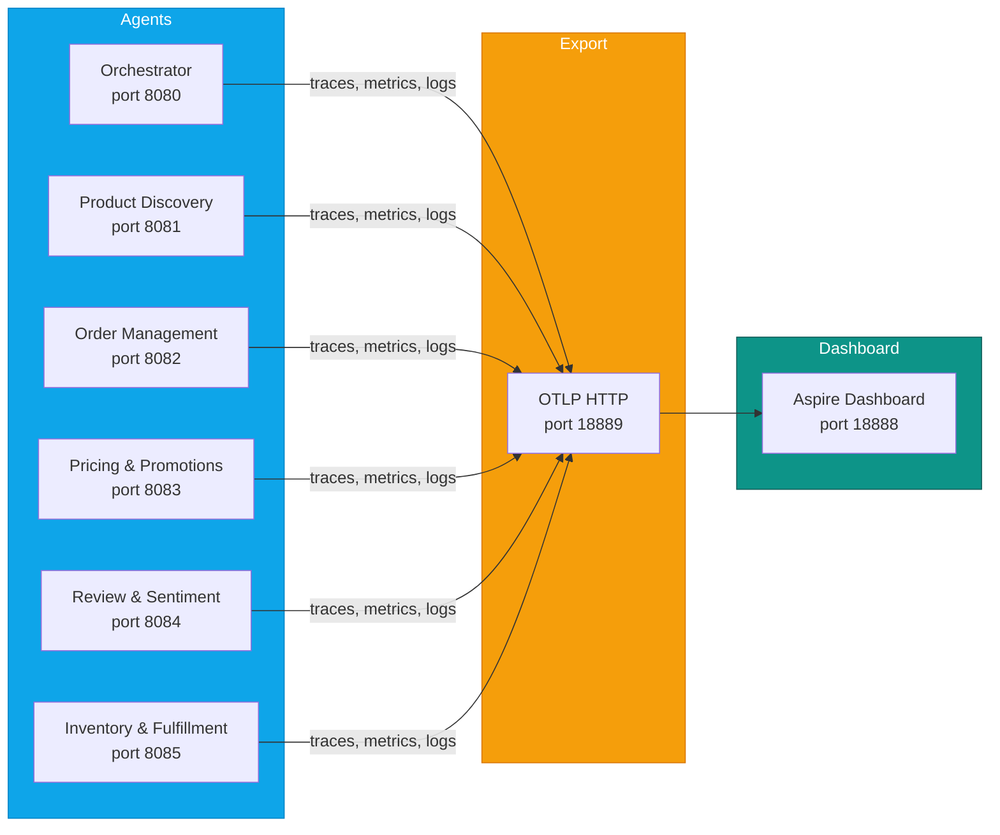
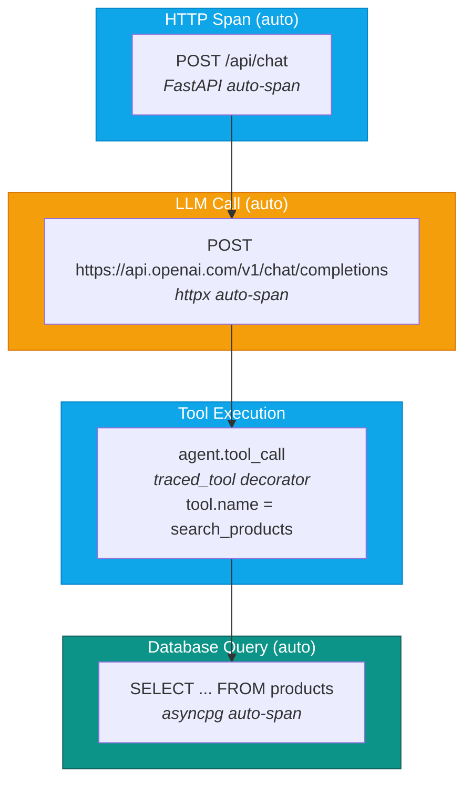
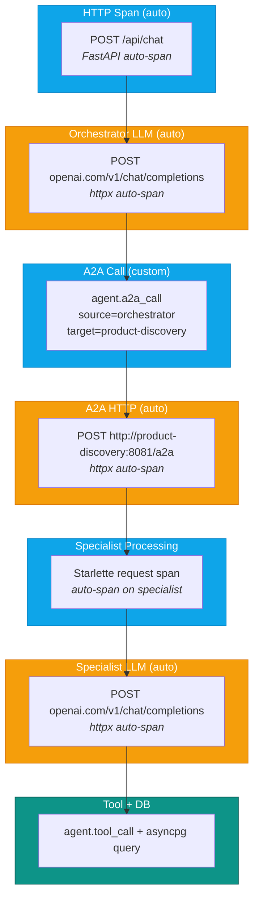

# Telemetry & Observability

E-Commerce Agents uses OpenTelemetry to export traces, metrics, and logs to the .NET Aspire Dashboard. Every agent calls `setup_telemetry(service_name)` during its lifespan startup, which configures providers, exporters, and auto-instrumentation in a single call.

## Telemetry Pipeline



All telemetry is exported via OTLP/HTTP (not gRPC) to the Aspire Dashboard's receiver endpoint. The dashboard provides a unified UI for traces, structured logs, and metrics without requiring Jaeger, Prometheus, or Grafana.

---

## Auto-Instrumentation

The following libraries are auto-instrumented with zero code changes in agent logic. Each instrumentor is loaded in `_do_setup()` after the providers are configured.

| Library | Instrumentor | What It Captures |
|---------|-------------|------------------|
| **httpx** | `HTTPXClientInstrumentor` | All outbound HTTP calls: OpenAI/Azure OpenAI API requests, inter-agent A2A calls. Captures URL, method, status code, duration. |
| **asyncpg** | `AsyncPGInstrumentor` | All PostgreSQL queries. Captures SQL text, database name, duration. Parameterized queries show `$1, $2` placeholders (no sensitive data leakage). |
| **FastAPI** | `FastAPIInstrumentor` | Orchestrator HTTP request/response spans. Captures route, method, status code, request duration. Applied via `instrument_fastapi(app)`. |
| **Starlette** | `StarletteInstrumentor` | Specialist agent HTTP spans (A2AAgentHost runs on Starlette). Applied via `instrument_starlette(app)`. |
| **Python logging** | `LoggingInstrumentor` | Bridges Python log records into OTel log pipeline with trace/span ID correlation. `set_logging_format=False` preserves existing log format. |

---

## Span Hierarchy

### Single Agent Request (Direct Tool Call)

When the orchestrator handles a request using its own tools without delegating to specialists:



### Multi-Agent Request (Orchestrator to Specialist)

When the orchestrator delegates to a specialist agent via A2A protocol:



The `agent.a2a_call` custom span wraps the entire A2A interaction, so Aspire shows the orchestrator-to-specialist delegation as a single logical operation containing the HTTP call, specialist processing, and nested LLM + DB calls.

---

## Custom Spans

Two custom span types are manually instrumented beyond what auto-instrumentation provides.

### `agent.a2a_call`

Created by the `a2a_call_span()` context manager in the orchestrator when calling a specialist agent.

```python
with a2a_call_span("orchestrator", "product-discovery", "http://product-discovery:8081/a2a"):
    result = await a2a_client.send(task)
```

**Attributes:**

| Attribute | Example |
|-----------|---------|
| `agent.source` | `orchestrator` |
| `agent.target` | `product-discovery` |
| `agent.target_url` | `http://product-discovery:8081/a2a` |

On exception, the span records the exception and sets `StatusCode.ERROR`.

### `agent.tool_call`

Created by the `@traced_tool` decorator, applied after the MAF `@tool` decorator on tool functions.

```python
@tool(name="search_products", description="...")
@traced_tool
async def search_products(...) -> ...:
```

**Attributes:**

| Attribute | Example |
|-----------|---------|
| `tool.name` | `search_products` |
| `tool.success` | `True` / `False` |

On exception, the span records the exception, sets `StatusCode.ERROR`, and sets `tool.success = False`.

---

## Service Names

Each agent reports with a distinct `OTEL_SERVICE_NAME` so traces and metrics can be filtered per service in the Aspire Dashboard.

| Agent | Service Name | Port |
|-------|-------------|------|
| Orchestrator (Customer Support) | `ecommerce-orchestrator` | 8080 |
| Product Discovery | `ecommerce-product-discovery` | 8081 |
| Order Management | `ecommerce-order-management` | 8082 |
| Pricing & Promotions | `ecommerce-pricing-promotions` | 8083 |
| Review & Sentiment | `ecommerce-review-sentiment` | 8084 |
| Inventory & Fulfillment | `ecommerce-inventory-fulfillment` | 8085 |

The service name is passed to `setup_telemetry()` in each agent's lifespan function and becomes the `service.name` resource attribute on all telemetry.

---

## Log Correlation

Python log records are automatically enriched with `trace_id` and `span_id` from the active OTel context. This is achieved through two mechanisms:

1. **LoggingInstrumentor** -- Injects `otelTraceID` and `otelSpanID` into Python `LogRecord` attributes. This allows log statements made during a traced request to be correlated back to the specific trace.

2. **OTel LoggerProvider + LoggingHandler** -- A `LoggingHandler` is attached to the Python root logger, which bridges all log records into the OTel log pipeline. These are exported via `OTLPLogExporter` to Aspire using `SimpleLogRecordProcessor` (immediate export, not batched) so logs appear in the dashboard in real-time.

The `trace_id` is also extracted and stored in the `usage_logs` table via `get_current_trace_id()`, creating a link between the application's audit log and the distributed trace:

```
usage_logs.trace_id  -->  Aspire Dashboard trace view
```

This means you can go from the admin audit log (`GET /api/admin/audit`) directly to the corresponding trace in Aspire by searching for the `trace_id` value.

---

## Aspire Dashboard

The Aspire Dashboard runs as a Docker container and provides the observability UI.

**Access:** [http://localhost:18888](http://localhost:18888)

Auth mode is set to `Unsecured` for local development (`DASHBOARD__FRONTEND__AUTHMODE: Unsecured`).

### What to Look For

| View | Use Case |
|------|----------|
| **Traces** | See the full request lifecycle from HTTP entry through LLM calls, A2A delegation, tool execution, and DB queries. Filter by service name to isolate a specific agent. |
| **Structured Logs** | View correlated logs for a trace. Click any trace to see all log statements emitted during that request across all agents. |
| **Metrics** | Request counts, latencies, and error rates per service. Metrics are exported every 15 seconds (`export_interval_millis=15000`). |
| **Resources** | See all registered services with their `service.name`, `service.version`, and `deployment.environment` attributes. |

### Typical Investigation Flow

1. User reports slow response -- go to **Traces**, filter by service `ecommerce-orchestrator`, sort by duration.
2. Find the slow trace -- expand to see which child span took the longest (LLM call? DB query? A2A call to a specialist?).
3. If the bottleneck is an A2A call -- click into the specialist's trace to see its internal spans.
4. Cross-reference with **Structured Logs** to see any warnings or errors logged during that trace.
5. Check the `trace_id` against `GET /api/admin/audit` for the application-level audit record.

---

## Configuration

All telemetry settings are managed via environment variables, loaded through Pydantic Settings (`shared/config.py`).

| Variable | Default | Description |
|----------|---------|-------------|
| `OTEL_ENABLED` | `false` | Master toggle. When `false`, `setup_telemetry()` returns immediately and no instrumentation is loaded. |
| `OTEL_EXPORTER_OTLP_ENDPOINT` | `http://localhost:18889` | Base URL for the OTLP HTTP receiver. The code appends `/v1/traces`, `/v1/metrics`, and `/v1/logs` automatically. |
| `OTEL_SERVICE_NAME` | `ecommerce` | Fallback service name. Overridden by each agent's `setup_telemetry(service_name)` call. |
| `ENVIRONMENT` | `development` | Mapped to `deployment.environment` resource attribute. |

### Docker Compose Ports

| Port | Service |
|------|---------|
| `18888` | Aspire Dashboard UI |
| `18889` (mapped to `18890` on host) | OTLP HTTP receiver inside the container |

Inside the Docker network, agents connect to `http://aspire:18889`. From the host, the receiver is accessible at `http://localhost:18890`.

### Enabling Telemetry

In `.env` or `docker-compose.yml` environment section:

```bash
OTEL_ENABLED=true
OTEL_EXPORTER_OTLP_ENDPOINT=http://aspire:18889
```

### Graceful Degradation

`setup_telemetry()` wraps the entire initialization in a try/except. If the Aspire Dashboard is unreachable or any instrumentor fails to load, the agent logs a warning and continues operating without telemetry. Individual instrumentors (`_instrument_httpx`, `_instrument_asyncpg`, `_instrument_logging`) also catch exceptions independently, so a failure in one does not prevent the others from loading.

---

## Resource Attributes

Every span, metric, and log record includes these resource attributes:

| Attribute | Source |
|-----------|--------|
| `service.name` | Passed to `setup_telemetry()` |
| `service.version` | Defaults to `1.0.0` |
| `deployment.environment` | From `settings.ENVIRONMENT` |

---

## Telemetry Signal Details

| Signal | Exporter | Processor | Export Behavior |
|--------|----------|-----------|-----------------|
| **Traces** | `OTLPSpanExporter` (HTTP) | `BatchSpanProcessor` | Batched export (SDK default: 5s interval, 512 span batch) |
| **Metrics** | `OTLPMetricExporter` (HTTP) | `PeriodicExportingMetricReader` | Every 15 seconds |
| **Logs** | `OTLPLogExporter` (HTTP) | `SimpleLogRecordProcessor` | Immediate (synchronous) export for real-time Aspire correlation |

Logs use `SimpleLogRecordProcessor` instead of batch processing because immediate export is critical for trace-log correlation in the Aspire Dashboard. The trade-off is slightly higher overhead per log statement, but this is acceptable for a demo/development setup.
