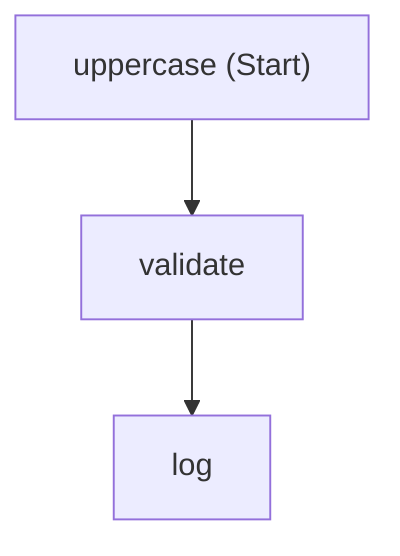
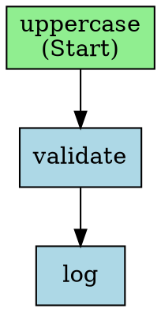

> **Series note** — Final advanced chapter before the capstone tour.

## Why this chapter

A workflow you can't see is hard to review and impossible to reason about on-call at 3 AM. MAF ships visualization helpers that turn any `Workflow` object into Mermaid (GitHub markdown rendering) or Graphviz DOT (for architecture diagrams in documentation, wikis, runbooks). They're deterministic — same graph → same bytes — so you can commit the output and diff changes in PRs.

## Prerequisites

- Completed [Chapter 19 — Declarative Workflows](../19-declarative-workflows/)

## The concept

One line to render, another to save. Both languages ship equivalent APIs.

| Python | .NET |
|--------|------|
| `WorkflowViz(workflow).to_mermaid()` | `workflow.ToMermaidString()` |
| `WorkflowViz(workflow).to_digraph()` | `workflow.ToDotString()` |
| `WorkflowViz(workflow).save_png(path)` | (external tool on DOT output) |

## Python

Source: [`python/main.py`](./python/main.py).

```python
from agent_framework._workflows._viz import WorkflowViz
from agent_framework._workflows._workflow_builder import WorkflowBuilder

workflow = (
    WorkflowBuilder(start_executor=uppercase, name="demo-pipeline")
    .add_edge(uppercase, validate)
    .add_edge(validate, log)
    .build()
)

mermaid = WorkflowViz(workflow).to_mermaid()
dot     = WorkflowViz(workflow).to_digraph()

pathlib.Path("workflow.mmd").write_text(mermaid)
pathlib.Path("workflow.dot").write_text(dot)
```

Rendered Mermaid:



Rendered DOT (excerpt):



## .NET

[Reference scaffold](./dotnet/Program.cs):

```csharp
using Microsoft.Agents.AI.Workflows;

string mermaid = workflow.ToMermaidString();
string dot     = workflow.ToDotString();

File.WriteAllText("workflow.mmd", mermaid);
File.WriteAllText("workflow.dot", dot);
```

## Side-by-side differences

| Aspect | Python | .NET |
|--------|--------|------|
| Mermaid | `WorkflowViz(wf).to_mermaid()` | `wf.ToMermaidString()` |
| DOT | `.to_digraph()` | `.ToDotString()` |
| Bitmap export | `.save_png(path)` uses graphviz binary | Pipe DOT output through the `dot` CLI |

## Gotchas

- **Node IDs must be unique.** Workflows with two nodes sharing an ID fail at build time (we hit this while writing this chapter — two `ValidateExecutor()` instances collide on id="validate"). Visualization renders fine once the build succeeds.
- **Mermaid is GitHub-native.** Commit `.mmd` alongside your code; GitHub renders it inline in issues/PRs/wikis.
- **DOT needs Graphviz to rasterize.** The `.dot` text is portable, but producing PNG/SVG from it requires a local or CI install of `graphviz`.
- **Determinism isn't free.** If your builder adds edges in a non-deterministic order (e.g., iterating a set), the rendered output shuffles. Iterate over ordered collections.

## Tests

```bash
# Python: 9 tests — non-empty output, flowchart directive, all nodes present,
# all edges present, deterministic (mermaid + dot), valid digraph header,
# build succeeds
source agents/.venv/bin/activate
python -m pytest tutorials/20-visualization/python/tests/ -v
# 9 passed
```

## How this shows up in the capstone

- Phase 7 `plans/refactor/13-visualization.md` scripts `scripts/visualize_workflows.py` that iterates every registered workflow (pre-purchase, return-replace, concierge) and writes Mermaid + DOT to `docs/workflows/`. A CI drift check fails the build if committed diagrams disagree with the current code.

## What's next

- Next (final) chapter: [Chapter 21 — Capstone Tour](../21-capstone-tour/)
- Full source: [`python/`](./python/) · [`dotnet/`](./dotnet/)
- [MAF docs — Visualization](https://learn.microsoft.com/en-us/agent-framework/workflows/visualization/)
