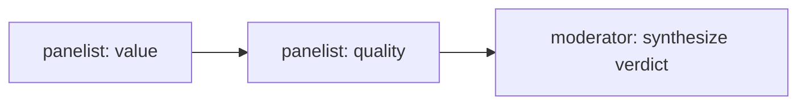

# Chapter 22 — Group-Chat Debate (Round-Table Orchestration)

A fourth MAF workflow pattern for this platform: a **round-table** where several
agents debate a question over a shared transcript, then a moderator synthesizes a
verdict. It complements the existing workflows:

- Concurrent fan-out/fan-in — `workflows/pre_purchase.py` (Chapter 13)
- Sequential + human-in-the-loop — `workflows/return_replace.py` (Chapter 17)
- **Round-table group chat — `workflows/group_chat.py` (this chapter)**

## When to use it

Use a round-table when several perspectives must *react to each other* before a
decision — e.g. "is this product worth buying?" weighed by a value/pricing voice
and a quality/reviews voice. Unlike the concurrent pattern (independent probes
merged once), each panelist sees the running transcript and can build on or
counter prior turns.



## How it works

Each panelist is an `Executor` that appends one turn to a shared `GroupChatState`
transcript and forwards it; the moderator is the terminal executor that yields the
synthesized verdict.

```python
from agent_framework._workflows._executor import Executor, handler
from agent_framework._workflows._workflow_context import WorkflowContext

class _PanelistExecutor(Executor):
    @handler
    async def run(self, state, ctx: WorkflowContext[GroupChatState, GroupChatState]):
        state.transcript.append({"speaker": self._name,
                                 "text": self._responder(state.question, state.transcript)})
        await ctx.send_message(state)          # forward to the next panelist
```

The forwarders are typed `WorkflowContext[State, State]`; the moderator (terminal)
is `WorkflowContext[None, State]` and calls `ctx.yield_output(state)`.

## Run it

Panelist behavior is a plain `Responder` callable, so you can run it without an LLM:

```python
import asyncio
from workflows.group_chat import GroupChatWorkflow

wf = GroupChatWorkflow(panelists=[
    ("value",   lambda q, transcript: "Strong price for the feature set."),
    ("quality", lambda q, transcript: f"Considering {len(transcript)} prior point(s): build quality is excellent."),
])
state = asyncio.run(wf.execute("Is the Sony WH-1000XM5 worth it?"))
print(state.verdict)
for turn in state.transcript:
    print(f"  {turn['speaker']}: {turn['text']}")
```

`workflows/group_chat.py` lives inside the `agents/python` package (it's the real
production module, not a copy), so the runnable demo script and its tests import it
as `workflows.group_chat` and need to run with `agents/python` on the path — this
chapter is not part of the `tutorials/` uv project:

```bash
cd agents/python
uv run python ../../tutorials/22-group-chat-debate/python/main.py
uv run pytest tests/test_workflow_group_chat.py -v
```

In production, wire each panelist to a specialist agent (e.g. `pricing-promotions`
and `review-sentiment`) by passing an agent-backed responder.

See `tutorials/22-group-chat-debate/python/main.py` in this chapter for a runnable
script and `agents/python/tests/test_workflow_group_chat.py` for the deterministic
tests.

## Key points

- Sequential round-table ≠ concurrent fan-out: turns are ordered and each sees the
  shared transcript.
- Inject panelist behavior so the workflow is unit-testable without a live LLM.
- Type the terminal executor `WorkflowContext[None, State]` — a forwarding type on
  the terminal stops the chain early.
